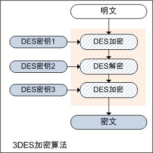
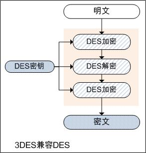
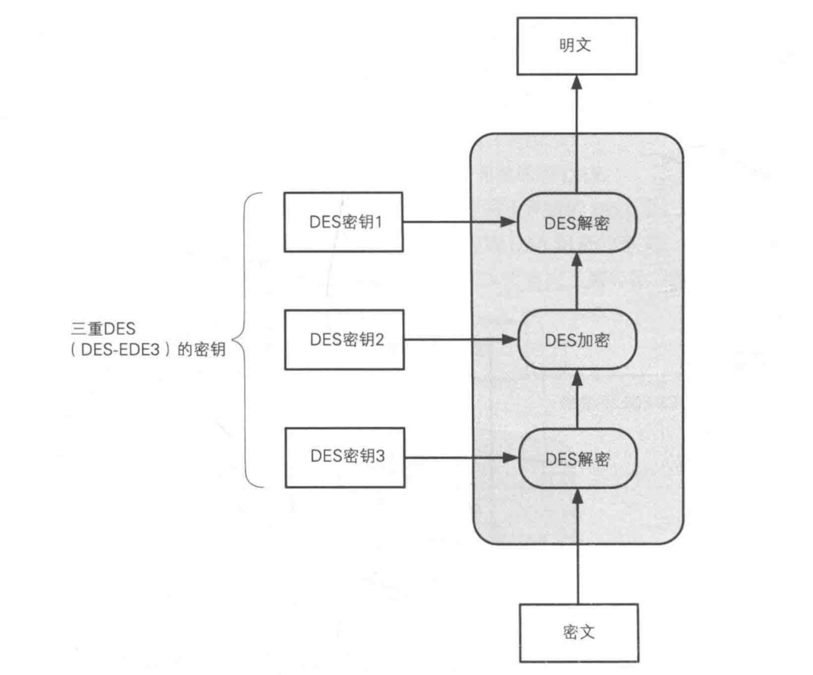

# 3DES加密算法原理

# **一、3DES加密算法简析：**

3DES，也称为 3DESede 或 TripleDES，是三重数据加密算法，相当于是对每个数据库应用三次DES的对称加密算法。

由于DES密码长度容易被暴力破解，所以3DES算法通过对DES算法进行改进，增加DES的密钥长度来避免类似的攻击，针对每个数据块进行三次DES加密；因此，3DES加密算法并非什么新的加密算法，是DES的一个更安全的变形，它以DES为基本模块，通过组合分组方法设计出分组加密算法。。

3DES是DES向AES过渡的加密算法，它使用2个或者3个56位的密钥对数据进行三次加密。相比DES，3DES因密钥长度变长，安全性有所提高，但其处理速度不高。因此又出现了AES加密算法，AES较于3DES速度更快、安全性更高。

# **二、3DES加密过程：**

该算法的加解密过程分别是对明文/密文数据进行三次DES加密或解密，得到相应的密文或明文。

假设EK（）和DK（）分别表示DES的加密和解密函数，P表示明文，C表示密文，那么加解密的公式如下：

加密：C = EK3（ DK2（ EK1（P）） ），即对明文数据进行，加密 --> 解密 --> 加密的过程，最后得到密文数据；

解密：P = DK1（ EK2（ DK3（C）） ），即对密文数据进行，解密 --> 加密 --> 解密的过程，最后得到明文数据；

其中：K1表示3DES中第一个8字节密钥，K2表示第二个8字节密钥，K3表示第三个8字节密钥，K1、K2、K3决定了算法的安全性，若三个密钥互不相同，本质上就相当于用一个长为168位的密钥进行加密。多年来，它在对付强力攻击时是比较安全的。若数据对安全性要求不那么高，K1可以等于K3。在这种情况下，密钥的有效长度为112位，即K1对应KL（左8字节），K2对应KR（右8字节），K3对应KL（左8字节）。

当三重密钥均相同时，前两步相互抵消，相当于仅实现了一次加密，因此可实现对普通DES加密算法的兼容。

由于DES加解密算法是每8个字节作为一个加解密数据块，因此在实现该算法时，需要对数据进行分块和补位（即最后不足8字节时，要补足8字节）。Java本身提供的API中NoPadding，Zeros填充和PKCS5Padding。假设我们要对9个字节长度的数据进行加密，则其对应的填充说明如下：

（1）NoPadding：API或算法本身不对数据进行处理，加密数据由加密双方约定填补算法。例如若对字符串数据进行加解密，可以补充\0或者空格，然后trim；

（2）ZerosPadding：无数据的字节全部被填充为0；

第一块：F0 F1 F2 F3 F4 F5 F6 F7

第二块：F8 0 0 0 0 0 0 0

（3）PKCS5Padding：每个被填充的字节都记录了被填充的长度；

①加密前：数据字节长度对8取余，余数为m，若m>0,则补足8-m个字节，字节数值为8-m，即差几个字节就补几个字节，字节数值即为补充的字节数，若为0则补充8个字节的8。

②解密后：取最后一个字节，值为m，则从数据尾部删除m个字节，剩余数据即为加密前的原文。

③加密字符串为为AAA，则补位为AAA55555;加密字符串为BBBBBB，则补位为BBBBBB22；加密字符串为CCCCCCCC，则补位为CCCCCCCC88888888。

（4）PKCS7Padding：

PKCS7Padding 的填充方式和PKCS5Padding 填充方式一样。只是加密块的字节数不同。PKCS5Padding明确定义了加密块是8字节，PKCS7Padding加密快可以是1-255之间。

# **三、3DES解密：**

3DES解密过程，与加密过程相反，即逆序使用密钥。是以密钥3、密钥2、密钥1的顺序执行 `解密->加密->解密`。

