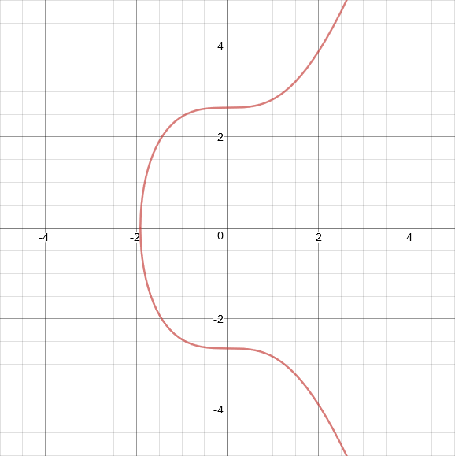
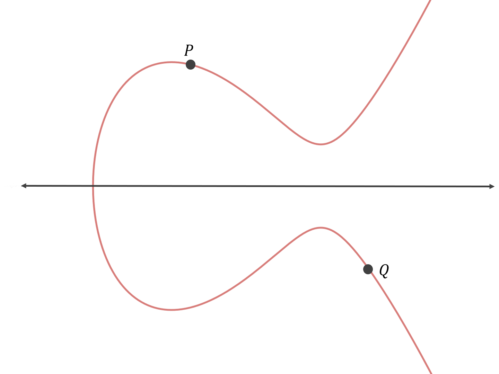
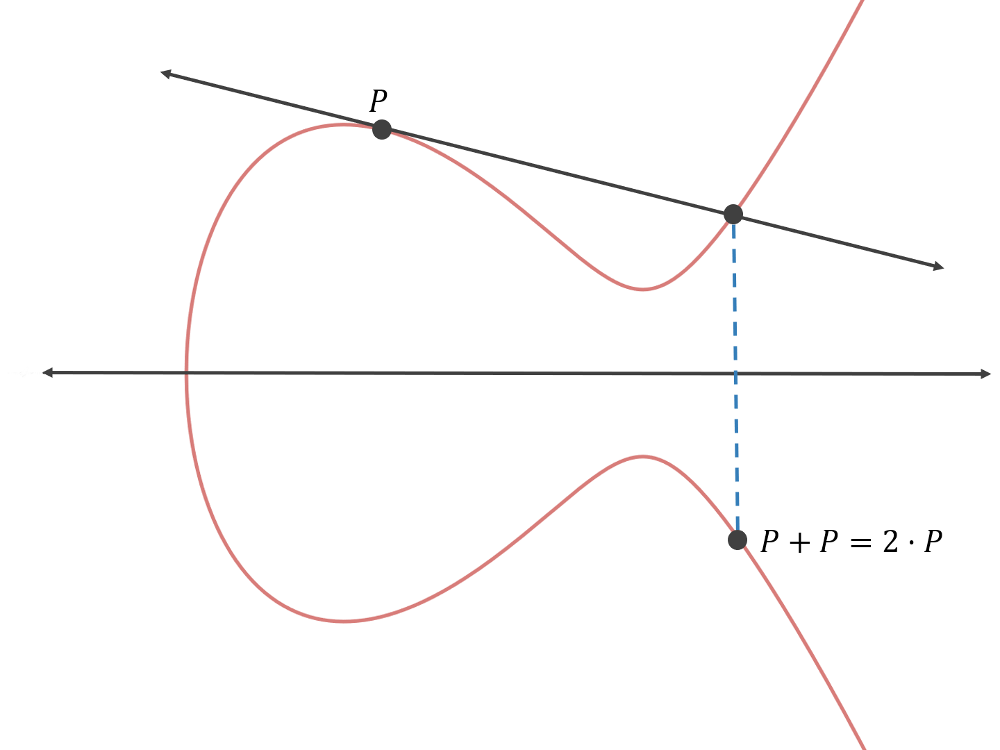

# 【密码学】序列密码
序列密码，又称为流密码（Stream Cipher），是一种对称加密算法。加密和解密双方使用相同伪随机加密数据流（Pseudo-Random Stream）作为密钥。

有时，序列密码也称为状态密码，因为它的加密不仅与密钥和明文有关，也和当前状态有关。

## 基本思想

可追溯到1917年维尔南（Vernam）体制，即**一次一密**（一次密码本, One Time Pad, OTP）密码体制。在理论上，此种密码具有**完善保密性**（`H(m|c) = H(m)`），是牢不可破的。它的安全性已由**克劳德·艾尔伍德·香农**所证明。

加密和解密过程也非常简单（逐位异或）：

但是，Bad news 是，它并不实用。为什么呢？**密钥长度至少要等于明文长度**，即 `len(key) >= len(msg)`，所以，既然我可以用安全信道传输 key，再用公开信道传输 ciphertext，那我为什么不直接用安全信道传输 msg 呢？而且密钥的分发和管理都非常困难。

然后，就有人想了，可不可以从很短的一个种子密钥生成一个伪随机序列呢？这样就可以模仿一次一密系统了。

## 加密和解密

预备知识：$a\oplus b\oplus a=b$ 。

伪随机密钥流（keystream）由一个随机的种子（seed）通过算法 PRG（Pseudo-Random Generator, 伪随机产生器, 也称 Pseudoramdom Key Generator, 密钥序列产生器, 也称 Keystream Generator, KG, 密钥序列产生器）得到，`k` 作为种子，则 `G(k)` 作为实际使用的密钥进行加密解密工作。为了保证流加密的安全性，PRG 必须是不可预测的。弱算法包括 `glibc random()` 函数（看 MIT 老师讲课就强调了这点2333），线性同余生成器（linear congruential generator）等。

-   Start with a fixed-length, shared secret. This is generally called the seed **s**.
-   Use a procedure that, with the seed as input, generates a stream of bits that seems random, but which is in fact deterministically computable (from s).
-   Use this stream (keystream) as the one-time pad: **XOR** it with the plaintext.

怎么解密呢？很简单，用 keystream 和密文逐位异或就行了。

## 分类

### 同步序列密码

密钥序列的产生独立于明文消息和密文消息。

#### 特性

**同步要求**

发送方和接收方必须同步（接收方要在相同状态下采用相同的密钥和运算），失步会导致解密失败。

**无错误传播**

传输过程中一个密文位被改变不影响其他密文位解密。

**主动攻击**

插入、删除、重放攻击会导致失步。

### 自同步序列密码

密钥流的产生依赖于密文流。

#### 特性

**自同步**  
只要接收方连续收到n个正确的密文符号，密钥序列产生器便会自动地恢复同步

**有限错误传播**  
设密钥序列产生器具有n位存储，则一个符号的传输错误只影响到后面n符号的解密。

**消除明文统计特性**

更好地抗击基于明文冗余的攻击。

## 线性反馈移位寄存器

英语：**L**iner-**F**eedback **S**hift **R**egister, LFSR

其长度用位表示，n位长叫做n级线性反馈移位寄存器。

可存储2n-1种状态（除去全0无止境输出0序列）。

为了使LFSR得到最大的周期（2n-1），其生成多项式（由抽头序列加上常数1形成的多项式）一定要是本原多项式，这样生成的序列叫做**m序列**（我们老师读作**小m序列**）。

> 周期性：若t1状态和t2状态相同，则t1+1状态和t2+1状态相同。而且，T一定是(t2-t1)的因数。

### 游程

英语：Run-length

游程就是指（一个周期中）连续的0序列或1序列。在真正的随机位序列中，游程的长度应该是随机分布的。

## 伪随机性测试

Golomb 对伪随机周期序列提出了三个随机性公设：

1.  在一个周期内，0 与 1 的个数相差至多为 1—— ${a_i}$ 中0与1出现的概率基本上相同
    
2.  在一个周期内，长为1的游程占游程总数的 1/2，长为2的游程占游程总数的 1/22，……，长为i的游程占游程总数的1/2i，……，且等长的游程中0游程个数和1游程个数相等——0与1在序列中每一位置上出现的概率相同
    
3.  异相自相关函数是一个常数——通过对序列与其平移后的序列做比较，不能给出其它任何信息
    

## m序列的破译

对于m-序列（周期为2n-1），如果攻击者知道了2n位明密文对，则可确定反馈多项式的系数（因为ki = mi＋ ci），从而确定该LFSR接下来的状态，也就能得到余下的密钥序列。
