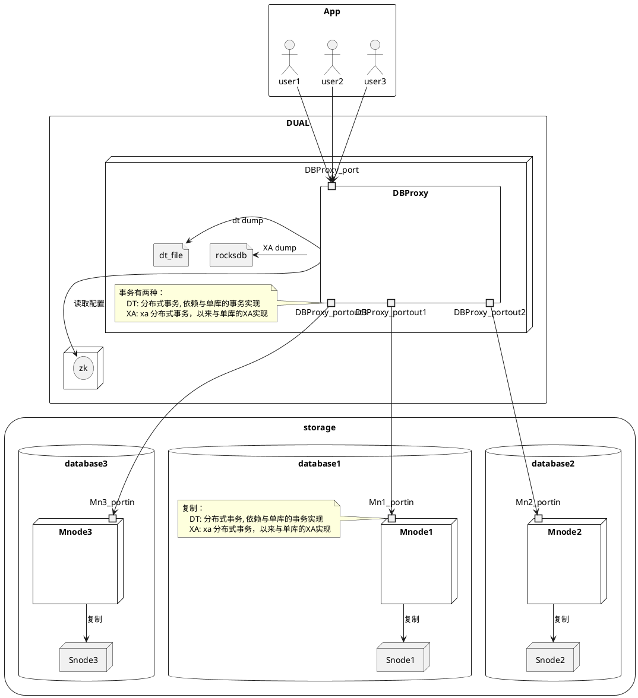

# 架构

```plantuml
@startuml
rectangle App {
    actor user1
    actor user2
    actor user3
}
rectangle DUAL {
    node {

        rectangle DBProxy {
            portin DBProxy_port
            portout DBProxy_portout1
            portout DBProxy_portout2
            portout DBProxy_portout3
        }

        note left
            事务有两种：
                DT: 分布式事务, 依赖与单库的事务实现
                XA: xa 分布式事务，以来与单库的XA实现
        end note


        file rocksdb

        file dt_file

        DBProxy -> rocksdb : XA dump
        DBProxy -> dt_file : dt dump
    }

    node  {
        storage zk {
        }
    }

    DBProxy --> zk : 读取配置
}

user1 --> DBProxy_port
user2 --> DBProxy_port
user3 --> DBProxy_port

storage storage {
    database database1 {
        node Mnode1 as Mn1 {
            portin Mn1_portin
        }
        note left
            复制：
                DT: 分布式事务, 依赖与单库的事务实现
                XA: xa 分布式事务，以来与单库的XA实现
        end note
        node Snode1 as Sn1
        Mn1 --> Sn1: 复制
    }

    database database2 {
        node Mnode2 as Mn2 {
            portin Mn2_portin
        }
        node Snode2 as Sn2
        Mn2 --> Sn2: 复制
    }

    database database3 {
        node Mnode3 as Mn3 {
            portin Mn3_portin
        }
        node Snode3 as Sn3
        Mn3 --> Sn3: 复制
    }
}

DBProxy_portout1 --> Mn1_portin
DBProxy_portout2 --> Mn2_portin
DBProxy_portout3 --> Mn3_portin
@enduml
```

## 复制
[[replication]]

## XA 流程

