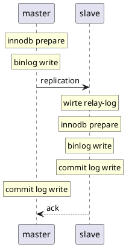

# XA
二阶段提交

## 启用
```sql
# 8.0 默认启用
# version < 8.0
set innodb_support_xa=ON
```

## uml


## xa 各阶段 binlog 变化
- 初始状态
```sql
XA START X'31',X'',1
/*!*/;
# at 329
#230417  9:29:50 server id 1  end_log_pos 389 CRC32 0xf80eb554  Table_map: `test_xa`.`user` mapped to number 93
# has_generated_invisible_primary_key=0
# at 389
#230417  9:29:50 server id 1  end_log_pos 439 CRC32 0x72477277  Write_rows: table id 93 flags: STMT_END_F
### INSERT INTO `test_xa`.`user`
### SET
###   @1=10591
###   @2=63
###   @3='test1'
# at 439
#230417  9:34:15 server id 1  end_log_pos 530 CRC32 0xb6d362ff  Query   thread_id=8     exec_time=0     error_code=0
SET TIMESTAMP=1681695255/*!*/;
XA END X'31',X'',1
/*!*/;
# at 530
#230417  9:34:15 server id 1  end_log_pos 567 CRC32 0xc226b8c4  XA PREPARE X'31',X'',1
XA PREPARE X'31',X'',1
/*!*/;
# at 567
#230417  9:44:13 server id 1  end_log_pos 644 CRC32 0x9d4c6091  Anonymous_GTID  last_committed=1        sequence_number=2       rbr_only=no     original_committed_timestamp=1681695853362833   immediate_commit_timestamp=1681695853362833
 transaction_length=171
# original_commit_timestamp=1681695853362833 (2023-04-17 09:44:13.362833 CST)
# immediate_commit_timestamp=1681695853362833 (2023-04-17 09:44:13.362833 CST)
/*!80001 SET @@session.original_commit_timestamp=1681695853362833*//*!*/;
/*!80014 SET @@session.original_server_version=80032*//*!*/;
/*!80014 SET @@session.immediate_server_version=80032*//*!*/;
SET @@SESSION.GTID_NEXT= 'ANONYMOUS'/*!*/;
# at 644
#230417  9:44:13 server id 1  end_log_pos 738 CRC32 0xbfdc35c8  Query   thread_id=11    exec_time=0     error_code=0
SET TIMESTAMP=1681695853/*!*/;
XA COMMIT X'31',X'',1
/*!*/;
ROLLBACK /* added by mysqlbinlog */ /*!*/;
```

- 执行 xa commit '1'时 没有变化
- 执行 insert into user (score, name) values( RAND() * 100, 'test1'); 没有变化
- 执行 xa end '1'时 没有变化
- 执行 xa prepare '1'时 
```sql
SET TIMESTAMP=1681697119/*!*/;
XA START X'31',X'',1
/*!*/;
# at 910
#230417 10:05:19 server id 1  end_log_pos 970 CRC32 0x23a5798a  Table_map: `test_xa`.`user` mapped to number 93
# has_generated_invisible_primary_key=0
# at 970
#230417 10:05:19 server id 1  end_log_pos 1020 CRC32 0xb85042bc         Write_rows: table id 93 flags: STMT_END_F
### INSERT INTO `test_xa`.`user`
### SET
###   @1=10592
###   @2=88
###   @3='test1'
# at 1020
#230417 10:06:54 server id 1  end_log_pos 1111 CRC32 0xe275ced1         Query   thread_id=14    exec_time=0     error_code=0
SET TIMESTAMP=1681697214/*!*/;
XA END X'31',X'',1
/*!*/;
# at 1111
#230417 10:06:54 server id 1  end_log_pos 1148 CRC32 0x3866a688         XA PREPARE X'31',X'',1
XA PREPARE X'31',X'',1
```
- 执行 xa commit '1' 时
```sql
/*!*/;
# at 1148
#230417 10:08:04 server id 1  end_log_pos 1225 CRC32 0xa4e686e1         Anonymous_GTID  last_committed=3        sequen
ce_number=4       rbr_only=no     original_committed_timestamp=1681697284769971   immediate_commit_timestamp=168169728
4769971     transaction_length=171
# original_commit_timestamp=1681697284769971 (2023-04-17 10:08:04.769971 CST)
# immediate_commit_timestamp=1681697284769971 (2023-04-17 10:08:04.769971 CST)
/*!80001 SET @@session.original_commit_timestamp=1681697284769971*//*!*/;
/*!80014 SET @@session.original_server_version=80032*//*!*/;
/*!80014 SET @@session.immediate_server_version=80032*//*!*/;
SET @@SESSION.GTID_NEXT= 'ANONYMOUS'/*!*/;
# at 1225
#230417 10:08:04 server id 1  end_log_pos 1319 CRC32 0xc8fdd7d9         Query   thread_id=14    exec_time=0     error_
code=0
SET TIMESTAMP=1681697284/*!*/;
XA COMMIT X'31',X'',1
```

## xa 各阶段崩溃 binlog 变化


## 几种 panic 状态
为了实验充分理解分布式事务

1，在两个db实例prepare之前
    两个事务都没有prepare，全局不可见，异常中断后，本地事务回滚掉了，在两个实例上恢复的时候，都是一致的

2，在db1  prepare之后，db2 prepare之前
    db1，已经prepare了，全局事务会记录下来，本地事务不会自动回滚掉，db2 没有prepare，本地事务会自动回滚掉
    ```shell
    # db1
    xa recover;
    +----------+--------------+--------------+------------+
    | formatID | gtrid_length | bqual_length | data       |
    +----------+--------------+--------------+------------+
    |        1 |           10 |            0 | 1671287200 |
    +----------+--------------+--------------+------------+
    1 row in set (0.00 sec)
    # db2
    xa recover;
    Empty set (0.00 sec)

    ```

    这个时候如果新开一个事务，会等待上一个没有结束的事务释放锁，而超时
    ```shell
    === xid:1671287283 ====
    === call start ====
    Error 1205: Lock wait timeout exceeded; try restarting transaction
    main.main
    ```

3，在两个db prepare之后，db1 commit之前
    两个事务都处于prepare状态，等待处理
    ```shell
    # db1
      mysql> xa recover;
    +----------+--------------+--------------+------------+
    | formatID | gtrid_length | bqual_length | data       |
    +----------+--------------+--------------+------------+
    |        1 |           10 |            0 | 1671287434 |
    +----------+--------------+--------------+------------+
    1 row in set (0.00 sec)
    # db2
      xa recover;
    +----------+--------------+--------------+------------+
    | formatID | gtrid_length | bqual_length | data       |
    +----------+--------------+--------------+------------+
    |        1 |           10 |            0 | 1671287434 |
    +----------+--------------+--------------+------------+
    1 row in set (0.00 sec)
    ```

4，在db1 commit之后， db2 commit之前
    db1已经提交，recover后是空，db2是待提交状态
    ```shell
    # db1
    mysql> xa recover;
    Empty set (0.00 sec)
    # db2
    xa recover;
    +----------+--------------+--------------+------------+
    | formatID | gtrid_length | bqual_length | data       |
    +----------+--------------+--------------+------------+
    |        1 |           10 |            0 | 1671289143 |
    +----------+--------------+--------------+------------+
    1 row in set (0.00 sec)
    ```
    这个时候可以操作db2的回滚，或者提交，db1已经提交，没法回滚了
    ```shell
    # db1
    xa rollback '1671289143';
    ERROR 1397 (XAE04): XAER_NOTA: Unknown XID
    # db2
    xa rollback '1671289143';
    Query OK, 0 rows affected (0.01 sec)
    ```

## 命令
```shell
## 开启本地事务
XA {START|BEGIN} xid [JOIN|RESUME] 

## 结束本地事务
XA END xid 

## 全局事务进入预备状态
XA PREPARE xid  

## 提交 xid
XA COMMIT xid[ONE PHASE] 

## 回滚 xid
XA ROLLBACK xid  

## 查看那些处于 prepare 状态
XA RECOVER[CONVERT XID ]
```

## 确认是否支持
```shell
show variables like 'innodb_support_xa';
+-------------------+-------+
| Variable_name     | Value |
+-------------------+-------+
| innodb_support_xa | ON    |
+-------------------+-------+
1 row in set
Time: 0.014s
```

## 例子

- 单会话测试 xa
```shell
create database test_xa;
use test_xa;
MySQL black@127.0.0.1:test_xa> CREATE TABLE `user` (
                            -> `id` int(10) unsigned NOT NULL AUTO_INCREMENT,
                            -> `score` int(10) unsigned NOT NULL,
                            -> `name` varbinary(255) NOT NULL,
                            -> PRIMARY KEY (`id`)
                            -> );
Query OK, 0 rows affected
Time: 0.060s

MySQL black@127.0.0.1:test_xa> show tables;
+-------------------+
| Tables_in_test_xa |
+-------------------+
| user              |
+-------------------+
1 row in set
Time: 0.008s

MySQL black@127.0.0.1:test_xa> xa start '1000';
Query OK, 0 rows affected
Time: 0.001s

MySQL black@127.0.0.1:test_xa> insert into user values(1, 10, "foo");
Query OK, 1 row affected
Time: 0.002s

MySQL black@127.0.0.1:test_xa> xa recover\G
0 rows in set
Time: 0.001s

MySQL black@127.0.0.1:test_xa> select * from `user`;
+----+-------+------+
| id | score | name |
+----+-------+------+
| 1  | 10    | foo  |
+----+-------+------+
1 row in set
Time: 0.010s

MySQL black@127.0.0.1:test_xa> xa end '1000';
Query OK, 0 rows affected
Time: 0.001s

MySQL black@127.0.0.1:test_xa> xa PREPARE '1000';
Query OK, 0 rows affected
Time: 0.013s


MySQL black@127.0.0.1:test_xa> xa recover;
+----------+--------------+--------------+------+
| formatID | gtrid_length | bqual_length | data |
+----------+--------------+--------------+------+
| 1        | 4            | 0            | 1000 |
+----------+--------------+--------------+------+
1 row in set
Time: 0.011s

MySQL black@127.0.0.1:test_xa> xa commit '1000';
Query OK, 0 rows affected
Time: 0.013s


MySQL black@127.0.0.1:test_xa> xa recover\G
0 rows in set
Time: 0.001s
```

- 一阶段 xa
```sql
MySQL black@127.0.0.1:test_xa> xa start '10';
Query OK, 0 rows affected
Time: 0.001s
MySQL black@127.0.0.1:test_xa> insert into user (id, score, `name`) values(580, 10000, "hole5");
Query OK, 1 row affected
Time: 0.001s
MySQL black@127.0.0.1:test_xa> xa end '10';
Query OK, 0 rows affected
Time: 0.001s
MySQL black@127.0.0.1:test_xa> xa recover\G
0 rows in set
Time: 0.001s
MySQL black@127.0.0.1:test_xa> xa commit '10' one phase;
Query OK, 0 rows affected
Time: 0.014s
```
