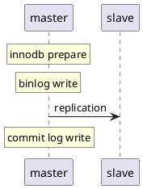
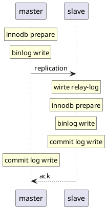
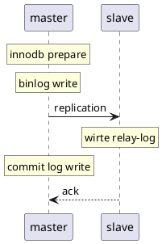
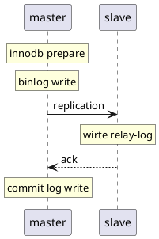

# replication
version >= 5.7
lossless replication 无损复制:
1. asynchronous 异步复制
2. fully synchronous 全同步复制
3. semisynchronous 半同步复制

## 配置
参数	comment	默认值	推荐值	是否动态
rpl_semi_sync_master_wait_for_slave_count	至少有N个slave接收到日志	1	1	dynamic
rpl_semi_sync_master_wait_point	等待的point	AFTER_SYNC	AFTER_SYNC	dynamic
rpl_semi_sync_master_timeout	切换复制的timeout	10000（10s）	1000(1s)	dynamic
rpl_semi_sync_master_enabled	是否开启半同步	OFF	ON	dynamic
rpl_semi_sync_slave_enabled	是否开启半同步	OFF	ON	dynamic

开启 lossless replication
########semi sync replication settings########
plugin_dir=/usr/local/mysql/lib/plugin
plugin_load = "rpl_semi_sync_master=semisync_master.so;rpl_semi_sync_slave=semisync_slave.so"
loose_rpl_semi_sync_master_enabled = 1
loose_rpl_semi_sync_slave_enabled = 1
loose_rpl_semi_sync_master_timeout = 1000

### 测试
innodb commit: 三阶段提交过程
A阶段. wite prepare log -- 写入Xid
B阶段. write binlog
C阶段. write commit log
0，RC模式
 
1. semi-sync C阶段等待
 
假设设置time-out=100000s，当事务一提交了一个大事务，在write commit log(C阶段)时候等待，
那么第二个事务在敲commit命令的时候，是卡在哪个阶段呢？是卡在 wite prepare log（A阶段）？还是write binlog（B阶段）？还是write commit log（C阶段）
 
测试：semi-sync vs loss-less semi-sync
 
semi-sync: C阶段等待:
1. 开启事务1，然后在slave上执行stop slave，制造timeout的情况，让其阻塞。(Waiting for semi-sync ACK from slave)
2. 在开启一个事务2，事务2插入一条特殊记录（XXXXX）。 (Waiting for semi-sync ACK from slave)
3. 在开启一个事务3。
3.
    1. 测试案例：这个时候，kill -9 mysqld，造成人为的mysql crash
4. 假设卡在A阶段，那么事务3，肯定是看不到事务1,2写入的记录（XXXXX）,且重启mysql后，事务2不会提交。
5. 假设卡在C阶段，那么事务3，肯定是可以看见事务1，2写入的记录（XXXXX）。
 
经过测试：
1. 是卡在C阶段，也就是说事务3是可以看见事务1，事务2的。
2. MySQL crash重启后，事务1，事务2的dml都已经提交成功，说明不是卡在A阶段
 
loss-less semi-sync:B阶段等待
 
0. 开启事务1，然后在slave上执行stop slave，制造timeout的情况，让其阻塞。(Waiting for semi-sync ACK from slave)
1. 在开启一个事务2，事务2插入一条特殊记录（XXXXX）。(Waiting for semi-sync ACK from slave)
2. 在开启一个事务3
3. 假设卡在A阶段，那么事务3，肯定是看不到事务1,2写入的记录（XXXXX）,且重启mysql后，事务2不会提交。。
4. 假设卡在B阶段，那么事务3，肯定是可以看见事务1,2写入的记录（XXXXX）,且重启mysql后，事务1，2都会提交。。
5. 假设卡在C阶段，那么事务3，肯定是可以看见事务3写入的记录（XXXXX）。
 
经过测试：
1. 是卡在B阶段，也就是说事务3，既看不见事务1的提交内容，也看不见事务2的提交内容，且重启mysql后，事务1，2都已经提交。。
2. MySQL crash重启后，事务1，事务2的dml都已经提交成功，说明不是卡在A阶段。

性能对比：
根据以上的测试，可以得知，lossless 只卡在B阶段，普通的 semi-sync 是卡在C阶段。
lossless 的性能远远好于普通的 semi-sync，即（after_sync 优于 after_commit）
因为lossless 卡在B阶段的时候可以堆积事务，可以在C阶段进行group commit。
普通的 semi-sync，卡在C阶段,事务都已经commit了，并没有堆积的过程。

## asynchronous
master 写数据到 binlog 并且 sync disk，slave request binlog 后写入 relay-log 并 flush disk
性能最好但是 master 崩溃后，slave 可能会丢失事务

## fully synchronous
master 写数据到 binlog 并且 sync disk 等待 slave commit 完成响应，slave request binlog 后写入 relay-log 并 flush disk sql 执行回放执行 commit log wirte
堵塞 master session，性能差，数据不会丢失

## semisynchronous replication
- 传统
原理: 在半同步复制中，master写数据到binlog且sync，且commit，然后一直等待ACK。当至少一个slave request bilog后写入到relay-log并flush disk，就返回ack（不需要回放完日志）
优点：会有数据丢失风险（低）
缺点：会阻塞master session，性能差，非常依赖网络，
代表：after commit, 原生的半同步
重点：由于master是在三段提交的最后commit阶段完成后才等待，所以master的其他session是可以看到这个提交事务的，所以这时候master上的数据和slave不一致，master crash后，slave数据丢失

- 增强
原理: 在半同步复制中，master写数据到binlog且sync，然后一直等待ACK. 当至少一个slave request bilog后写入到relay-log并flush disk，就返回ack（不需要回放完日志）
优点：数据零丢失（前提是让其一直是lossless replication），性能好
缺点：会阻塞master session，非常依赖网络
代表：after sync, 原生的半同步
重点：由于master是在三段提交的第二阶段sync binlog完成后才等待, 所以master的其他session是看不见这个提交事务的，所以这时候master上的数据和slave一致，master crash后，slave没有丢失数据

