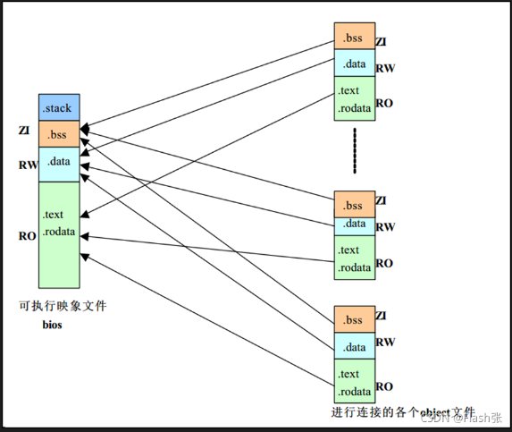
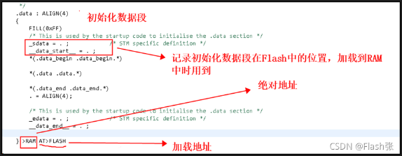
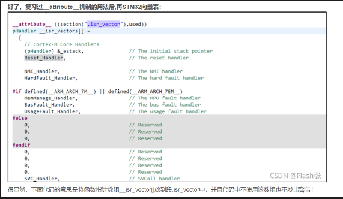

# ld

# 1 概念

## 1.1 链接脚本

用来描述程序是如何在内存空间中分布的。
编译器会根据链接脚本输出可执行文件。
ARM Compiler编译器用的scat格式的链接脚本，gcc编译器用的是ld格式的脚本，不同脚本语法是不一样的。

GCC在编译C语言文件的时候，会分别生成RO、RW、ZI部分。
RO是只读段，也就是程序代码段(.text)，就是具体函数代码；
RW是读写数据段(.data)，也就是初始化的全局变量；ZI为未初始化数据段(.bss),也就是那些未赋初值的变量，这个段不占用ROM空间，只有在程序运行的时候在RAM初始化为0。
链接脚本的作用也就是将这些编译出来的段整合到一起。



## 1.2 输入段、输出段

这个概念个人理解如下：

```ld
.text/*输出段有的也叫 节 */
{
    *start.o(StartUp) /*输入段*/
    *(.text)/*输入段*/
    *(.rodata) /*输入段*/
} >RAM0
```


链接脚本主要目的是指定.text .data .bss 段在内存中的地址。
我理解的.text .data .bss 就是输出段，也有文章把这些叫做“节”。

而输出段又由脚本编写者灵活设置，例如把具体start.o、.text、.rodata 放到.text中。
我理解的start.o、.text、.rodata 就是输入段。

可以看到输入段输出段都有.text，是可以同名的。
如果没有为某些输入段指定输出段，则链接器将创建一个与输入段同名的输出段。

个人理解，不知准确否。

# 2 实例

```ld
ENTRY(begincode)

MEMORY
{
    RAM0 (xrw)： ORIGION(0x00000000), LENGTH = 2M
    RAM1 (xrw)： ORIGION(0x30000000), LENGTH = 128M
}

SECTIONS
{
    . = ORIGION(RAM0);
    .text
    {
        *start.o(StartUp)
        *(.text)
        *(.rodata)
    } >RAM0 AT>FLASH
    .bss (NOLOAD) : SUBALIGN(0x10)
    {
        PROVIDE(_bss_begin = ABSOLUTE(.));
        *(.bss )
        PROVIDE(_bss_over = ABSOLUTE(.));
    } >RAM0 AT>FLASH
}
```

# 3 实例解析

## 3.1 ENTRY(symbol)

ENTRY(begincode) 代表我们使用 begincode 作为程序入口地址，默认是start

.global begincode
begincode
LDR R0, #0 

ld有多种指定程序入口方式：(优先级逐渐降低)
 a、ld命令 -e选项；
 b、连接脚本中ENTRY(symbol)的命令；
 c、如果定义了_start符号，使用_start符号的值；
 d、如果存在.text段，则使用.text段的第一字节的地址；
 e、使用地址0x00000000；

## 3.2 MEMORY

```ld
MEMORY
{
    /*标准格式如下*/
    name [(attr)] : ORIGIN = origin, LENGTH = len
    RAM0 (xrw)： ORIGION(0x00000000), LENGTH = 2M
    RAM1 (xrw)： ORIGION(0x30000000), LENGTH = 128M
}
```

name是一块内存的名称，自定义，但不得重复，仅在ld文件中生效。

attr字符串是可选的属性列表：
‘R’ Read-only section 只读段
‘W’ Read/write section 读写段
‘X’ Executable section 可执行段
‘A’ Allocatable section 可分配段
‘I’ Initialized section 初始化段
‘L’ Same as ‘I’
‘!’ Invert the sense of any of the preceding attributes 反转任何前述属性的含义

一旦你定义了一个内存区域，你也可以指示编译器把指定的输出段放入到这个内存区域中，使用’>REGION’设置输出段属性。
 比如，如果你有一个名为’mem’的内存区域，你可以在输出段定义中使用’>mem’。
 如果没有为输出段指定地址，连接器就会把地址设置为内存区域中的下一个可用的地址。

## 3.3 SECTIONS

```ld
SECTIONS
{
    . = ORIGION(RAM0); /*设置当前位置计数器 . 的值*/
    .text /*输出段名*/
    {
        *start.o(StartUp)
        *(.text)
        *(.rodata)
    } >RAM0 AT>FLASH

    .bss (NOLOAD) : SUBALIGN(0x10)
    {
        PROVIDE(_bss_begin = ABSOLUTE(.));
        *(.bss )
        PROVIDE(_bss_over = ABSOLUTE(.));
    } >RAM0 AT>FLASH

    /*标准格式如下*/
    section-name [address] [(type)] :
    [AT(lma)]
    [ALIGN(section_align)]
    [SUBALIGN(subsection_align)]
    [constraint]
    {
        output-section-command
        output-section-command
        ...
    } [>region] [AT>lma_region] [:phdr :phdr ...] [=fillexp]
}
```
 

### 3.3.1 输出段名(节点名)

输出段名必须符合输出格式的约束，例如a.out 输出格式包含'.text' '.data' '.bss' 三个输出段名。

### 3.3.2 输出段属性(节点属性)

NOLOAD 该部分应标记为不可加载，以便在程序运行时不会将其加载到内存中。
 DSECT
 COPY
 INFO
 OVERLAY 支持这些类型名称以实现向后兼容，并且很少使用。 它们都具有相同的效果：该段应标记为不可分配，以便在程序运行时不为该段分配内存。

### 3.3.3 输出段地址

每个段都有LMA（加载内存地址）和VMA（虚拟内存地址）
 LMA = load memory address
 VMA = vitual memory address

LMA就是程序放置的地址，VMA就是运行时的地址。
 如果程序是在ram里运行,但程序是存储在flash里,则运行地址指向ram,而加载地址指向flash。

上述例子中VMA为RAM0，LMA为FLASH；
 [>region] 指定输出段分布在内存上的地址。
 [AT(lma)] 指定该段的加载地址。另外，您也可以使用[AT>lma_region]表达式指定。
 



如果未为输出段指定AT或AT>，则链接器将设置当前段的VMA和LMA与同一区域中的先前输出段的设置相同。 如果没有前面的输段或该段不可分配，则链接器会将LMA与VMA设置为相同的值。

### 3.3.4 强制对齐 ALIGN

强制输出对齐ALIGN
 强制输入对齐SUBALIGN， 指定的值会覆盖输入段给出的任何对齐方式。

### 3.3.5 输出段填充 FILL

段中任何其他未指定的内存区域（例如，由于输入段的对齐而留下的间隙）将使用表达式的值将其填充。
 通过包含多个FILL语句，您可以在输出段的不同部分中使用不同的FILL模式。

例如：使用值“ 0x90”填充未指定的内存区域：

```ld
SECTIONS
{
    .text /*输出段名*/
    {
        FILL(0X09090909) /*FILL(0xFF)*/
        *start.o(StartUp)
        *(.text)
        *(.rodata)
    } >RAM0 AT>FLASH
}
```

### 3.3.6 输入段 描述

输入段描述由一个文件名(可选)和一个圆括号内的段名称列表组成。


```ld
# 例如:
 *(EXCLUDE_FILE (*crtend.o) .ctors) EXCLUDE_FILE(文件列表)表示剔除指定的输入文件，即不包含这些文件的指定段。
 *(.text .rdata) 这种方法两个段顺序是不定的。
 *(.text) *(.rdata) 这种方法两个段顺序是固定的。
 data.o(.data) 指定某个文件的某个段。
```

### 3.3.7 输入段 通用符号（common symbols）

在许多目标文件格式中，通用符号并没有占用一个section。
 在大多数情况下，输入文件中的通用符号将放置在输出文件中的“ .bss”部分。 例如：.bss { *(.bss) *(COMMON) }

### 3.3.8 PROVIDE

‘PROVIDE’关键字可以被用来定义一个符号(全局变量？),比如’etext’, 这个定义只在它被引用到的时候有效,而在它被定义的时候无效.

语法是 ：

```ld
SECTIONS
{
    .text :
    {
        *(.text)
        PROVIDE(etext = .);
    }
}
```


在这个例子中, 如果程序定义了一个’_etext’(带有一个前导下划线), 连接器会给出一个重定义错误. 如果,程序定义了一个’etext’(不带前导下划线), 连接器会默认使用程序中的定义. 如果程序引用了’etext’但不定义它,连接器会使用连接脚本中的定义。

总结下来就是：
PROVIDE定义的符号，允许C语言中重定义(但是不能带前导下划线)，重定义后优先使用C中的定义。

### 3.3.9 ABSOLUTE

PROVIDE(_bss_over = ABSOLUTE(.));

将当前地址的绝对值赋值给_bss_over

### 3.3.10 KEEP

KEEP(*(.Vectors))

作用是防止垃圾收集机制把重要的节排除在外，也保证了KEEP对象在段中的位置处于最顶端。

### 3.3.11 其它符号

1、LOADADDR(.data):
获取.data段的加载地址(lma)，也就是data段在Flash中存放的起始地址。用于程序启动后，在进入main之前，将.data从flash搬运到ram。

2、ADDR(.data):
获取.data段的绝对地址(也叫运行地址vma)，也就是加载到RAM的地址。

3、LONG()
则是在此处存入4字节,括号里是要存入的内容。

4、ATTRIBUTE
 


