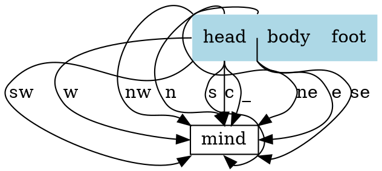
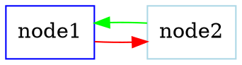
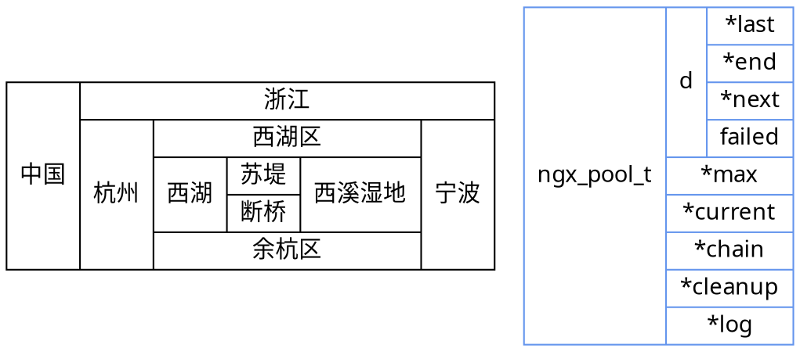
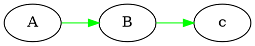
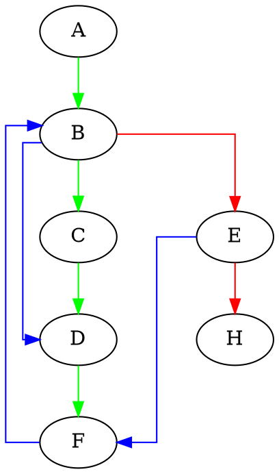
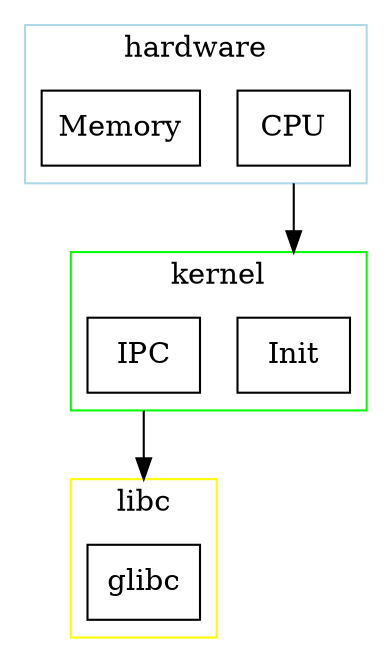

# graphviz
绘图工具
推荐 ProcessOn

## 安装
```shell
sudo apt install graphviz
```

## 命令
```shell
dot TCP-IP.dot -Tpng -o TCP-IP.png
```

## dot 语言
Graphviz 构建组件为 图、节点、边，用属性对其进行描述
DOT 语言的抽象语法，约束规则如下：
- 元素的终止以**粗体**显示
- 文字字符用单引号 '' 引起来
- 圆括号 () 的内容为必选项
- 方括号 [] 为可选项
- 竖杠 | 为择一选择

- 声明 | 结构
graph | [ strict ] (graph | digraph) [ ID ] '{' stmt_list '}'
stmt_list | [ stmt [ ';' ] stmt_list ]
stmt | node_stmt | edge_stmt | attr_stmt | ID '=' ID | subgraph
attr_stmt | (graph | node | edge) attr_list
attr_list | '[' [ a_list ] ']' [ attr_list ]
a_list | ID '=' ID [ (';' | ',') ] [ a_list ]
edge_stmt | (node_id | subgraph) edgeRHS [ attr_list ]
edgeRHS | edgeop (node_id | subgraph) [ edgeRHS ]
node_stmt | node_id [ attr_list ]
node_id | ID [ port ]
port | ':' ID [ ':' compass_pt ] | ':' compass_pt
subgraph | [ subgraph [ ID ] ] '{' stmt_list '}'
compass_pt | (n | ne | e | se | s | sw | w | nw | c | _)

ID 其实就是一个字符串，为该组件的名称或者属性的名称，命名规则如下：
1. 所有的字母 [a-zA-Z\200-\377] 下划线，数字 [0-9]，数字不能出现在起始位置
2. 纯数字 $[-]?(.[0-9]+ | [0-9]^+(.[0-9]*))?$
3. 所有用双引号引用的字符串 "..."
4. HTML 格式的字符串 <>

dot 语法关键字
- strict, 严格的图限定，禁止创建多个相同的边
- graph, 无向图. 在图的创建时必须声明为有向图还是无向图
- digraph, 有向图
- node, 节点
- edge, 边
- subgraph, 子图

总结：
1. 整个 graph 必须使用 graph 或 digraph {} 进行限定说明图的属性
2. 图里面的声明列表可以为空，也可以为多个，每个声明后的 ; 为可选项
3. 声明有几种类型
    1. 节点 node
    2. 边 edge
    3. 子图 subgraph
    4. 属性列表
    5. ID = ID, 这个类型暂时还没有看到有什么作用
4. 属性列表
    1. 必须使用中括号 [ ] 将列表项括起来
    2. 列表项为可选
5. 属性列表项
    1. 以 key = value 的形式存在，列表项可选择 ',' 和 ';' 结尾
    2. 可存在多个列表项
6. 边的声明
    1. 首端为 节点标识符或者子图，
    2. 右部分由边连接节点标识符或者子图构成，右部分可以存在多个
    3. 尾部可选属性列表
7. 节点的声明
```dot
示例 节点的用法
node0 [label = "<postid1> string|<postid2> string|<postid3> string3", height=.5]`
node0:head[color=lightblue]  // 设置该部分的颜色
```
1. 首部为节点标识符 节点部分(post) 方向 组成，其中后两项为可选项。
2. 后半部分为可选的属性列表

方向 | 说明
n | north 北
ne | north east 东北
e | east 东
se | south east 东南
s | south 南
sw | south west 西南
w | west 西
nw | north west 西北
c | center 中部
_ | 任意

例子:


### 绘制属性
- 节点
- 边
- 子图

一个图中有非常多的 node 和 edge，如果每次都需要声明一个节点的属性会非常麻烦
有一个简单的方式为声明一个公共的属性如

节点里面还可以嵌套多个结构，如


部分常用的属性:
- charset 编码，一般设置 UTF-8
- fontname 字体名称，这个在中文的情况需要设置，否则导出图片的时候会乱码，一般设置微软雅黑("Microsoft YaHei"), linux 下也是同样设置系统带的字体就好，其他字体设置见fontpath 属性
- fontcolor 字体颜色
- fontsize 字体大小，用于文本内容
- fillcolor 用于填充节点或者集群(cluster)的背景颜色。
- size 图形的最大宽度和高度
- label　图形上的文本标记
- margin 设置图形的边距
- pad 指定将绘制区域扩展到绘制图形所需的最小区域的长度（以英寸为单位）
- style 设置图形组件的样式信息。 对于聚类子图或者节点，如果style = "filled"，则填充聚类框的背景 
![[imgs/Pasted image 20230415115725.png]]
- rankdir 设置图形布局的排列方向 (全局只有一个生效). "TB", "LR", "BT", "RL", 分别对应于从上到下，从左到右，从下到上和从右到左绘制的有向图
![[imgs/Pasted image 20230415115810.png]]
![[imgs/Pasted image 20230415115819.png]]
- ranksep 以英寸为单位提供所需的排列间隔
- ratio 设置生成图片的纵横比

#### 节点(node)
节点的默认属性为 shape = ellipse, width = .75, height = 0.5 并且用节点标识符作为节点的显示文字。

如图一中所示，声明两个节点 node0 和 node2，node0 或 node2 就表示这个节点的节点标识符，后面紧跟的是该节点的属性列表；另一种用法为 节点标识符:节点部分:方向[属性列表] node0:body[style=filled color=lightblue], 这个为单一节点声明的方式。

节点中最基本的属性为：
- shape 形状
![[imgs/Pasted image 20230415120924.png]]
- width height, 图形的宽度和高度，如果设置了 fixedsize 为 true，则宽和高为最终的长度
- fixedsize, 如果为false，节点的大小由其文本内容所需要的最小值决定
- rank 子图中节点上的排列等级约束. 最小等级是最顶部或最左侧，最大等级是最底部或最右侧。
    - same. 所有节点都位于同一等级
    - min. 所有节点都位于最小等级上
    - source. 所有节点都位于最小等级上，并且最小等级上的唯一节点属于某个等级 source 或 min 的子图.
    - max sink. 和上类似
#### 边(edge)
有向图中的的边用 -> 表示，无向图用 -- 表示
可以同时连接多个节点或者子图，但是只能有一个属性列表，如下

一些关于边的属性如下：


- len 首选边的长度
- weight 边的权重, 权重越大越接近边的长度
    设置 A->B->C->D->F的权重最大，修改绿色的分支的权重为 100，使其变成主要逻辑分支。
- lhead 逻辑边缘的头部(箭头那个位置)，compound 设置为 true 时，边被裁减到子图的边界处
- ltail 类似 lhead
- headlabel 边上靠近箭头部分的标签
- taillabel 边上靠近尾部部分的标签
- splines 控制如何以及是否表示边缘。其值如下
    - none 或者 "", 无边
![[imgs/Pasted image 20230415144927.png]]
    - true 或者 spline, 样条线（无规则，可为直或者曲线）
![[imgs/Pasted image 20230415144959.png]]
    - false 或者 line, 直线段
![[imgs/Pasted image 20230415145020.png]]
    - polyline, 折线
![[imgs/Pasted image 20230415145102.png]]
    - curved, 曲弧线，两条？
![[imgs/Pasted image 20230415145137.png]]
    - ortho, 正直的线（横竖）
![[imgs/Pasted image 20230415145203.png]]
- dir 设置绘制箭头的边缘类型
![[imgs/Pasted image 20230415145229.png]]

#### 子图
subgraph 必须配合 cluster 一起使用，用法为 subgraph cluster* {}

需要设置 compound 为 true，则在群集之间留出边缘，子图的边界关系在 边 的定义中有给出，这里直接给个示例。

