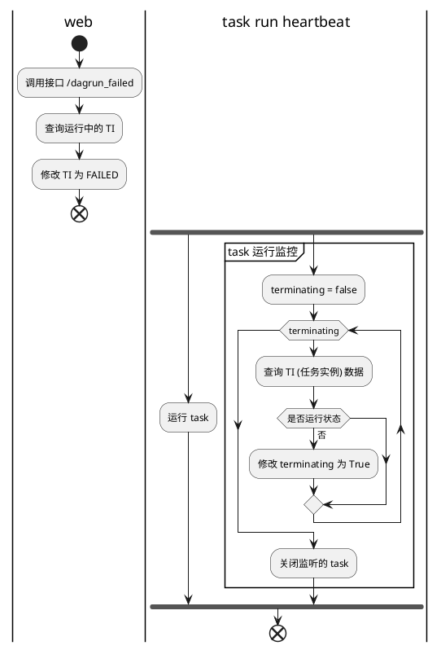

# kill task

关闭 task

```plantuml
@startuml
|web|
start
:调用接口 /dagrun_failed;
:查询运行中的 TI;
:修改 TI 为 FAILED;
end
|task run heartbeat|
fork
    :运行 task;
fork again
    partition "task 运行监控" {
        :terminating = false;
        while (terminating)
            :查询 TI (任务实例) 数据;
            if (是否运行状态) then (否)
                :修改 terminating 为 True;
            endif
        endwhile
        :关闭监听的 task;
        
    }
endfork
end
@enduml
```
