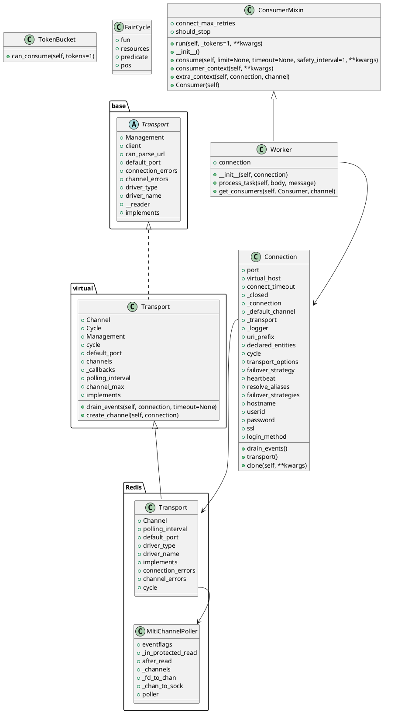

# 数据结构

```dot
digraph kombu{

}
```



```plantuml
|main|
start
:Connection() as conn;
|worker|
:Worker(conn).run();
|ConsumerMixin|
:ConsumerMixin.run();
|TokenBucket|
:TokenBucket(1).can_consume(1);
:self._get_tokens();
|ConsumerMixin|
:consume();
:consumer_context();
:Consumer();
:establish_connection();
|Connection|
:conn.default_channel();
:conn.drain_events(timeout=safety_interval);
:transport(self);
:create_transport(self);
:get_transport_cls(self);
|transport|
:get_transport_cls(transport_cls);
:resolve_transport(transport=None);
|redis.transport|
:transport.drain_events(self.connection, **kwargs);
|base.transport|
:transport.drain_events(self.connection, **kwargs);
|MultiChannelPoller|
:cycle.get();
|redis.transport|
:get(self, callback, timeout=None);
|eventio|
:self.poller.poll(timeout);
```
