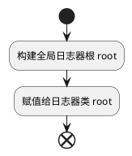
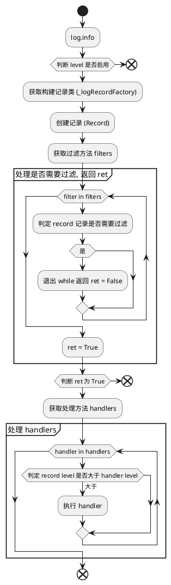

# logging

root(RootLogger)
全局(进程内)

1. Logger (日志器)
2. Filterer (过滤器)
3. handler (处理)
3. Manager (Logger 管理)

- logging init

```plantuml
@startuml
start
:构建全局日志器根 root;
:赋值给日志器类 root;
end
@enduml
```

- log.info()

```plantuml
@startuml
start
:log.info;

if (判断 level 是否启用) then
    end
else
    :获取构建记录类 (_logRecordFactory);
    :创建记录 (Record);
    :获取过滤方法 filters;
    partition "处理是否需要过滤, 返回 ret" {
        while (filter in filters)
            :判定 record 记录是否需要过滤;
            if (是) then
                :退出 while 返回 ret = False;
            endif
        endwhile

        :ret = True;
    }
    
    if (判断 ret 为 True) then
        :获取处理方法 handlers;
        partition "处理 handlers" {
            while (handler in handlers)
                if (判定 record level 是否大于 handler level) then (大于)
                    :执行 handler;
                endif
            endwhile
        }
    else
        end
    endif
endif

end
@enduml
```

