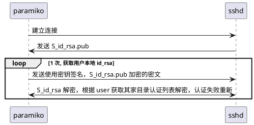

```plantuml
@startuml
paramiko -> sshd: 建立连接
sshd -> paramiko: 发送 S_id_rsa.pub
loop 1 次, 获取用户本地 id_rsa
    paramiko -> sshd: 发送使用密钥签名，S_id_rsa.pub 加密的密文
    sshd <-> paramiko:  S_id_rsa 解密，根据 user 获取其家目录认证列表解密，认证失败重新
end
@enduml
```