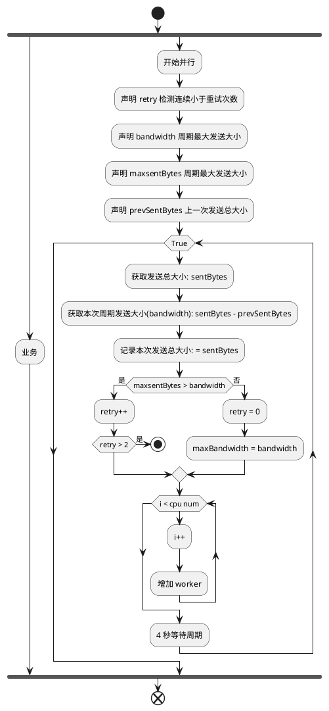

# parallel manager

并行管理

```plantuml
@startuml
start

    fork
    :业务;

    fork again
    :开始并行;

    :声明 retry 检测连续小于重试次数;
    :声明 bandwidth 周期最大发送大小;
    :声明 maxsentBytes 周期最大发送大小;
    :声明 prevSentBytes 上一次发送总大小;
    while (True)
        :获取发送总大小: sentBytes;
        :获取本次周期发送大小(bandwidth): sentBytes - prevSentBytes;
        :记录本次发送总大小: = sentBytes;
        if (maxsentBytes > bandwidth) then (是)
            :retry++;
            if (retry > 2) then (是)
                stop
            endif
        else (否)
            :retry = 0;
            :maxBandwidth = bandwidth;
        endif
        
        while (i < cpu num)
            :i++;
            :增加 worker;
        endwhile

        :4 秒等待周期;
    endwhile


    end fork
end
@enduml
```
