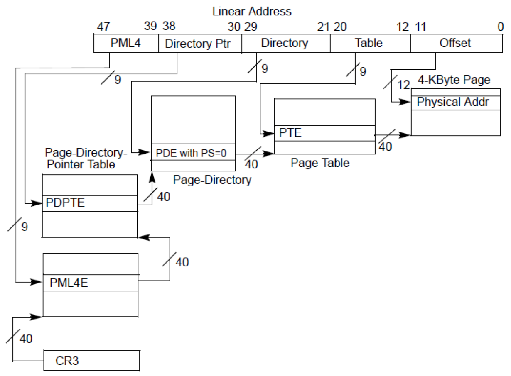

# PGD
Page Global Directory

Linux系统中每个进程对应用户空间的pgd是不一样的，
但是linux内核 的pgd是一样的。
当创建一个新的进程时，都要为新进程创建一个新的页面目录PGD，
并从内核的页面目录swapper_pg_dir中复制内核区间页面目录项至新建进程页面目录PGD的相应位置，
具体过程如下：
do_fork() --> 
    copy_mm() --> 
        mm_init() --> 
            pgd_alloc() --> 
                set_pgd_fast() --> 
                    get_pgd_slow() --> 
                        memcpy(&PGD + USER_PTRS_PER_PGD, swapper_pg_dir +USER_PTRS_PER_PGD, (PTRS_PER_PGD - USER_PTRS_PER_PGD) * sizeof(pgd_t))

这样一来，每个进程的页面目录就分成了两部分，第一部分为“用户空间”，
用来映射其整个进程空间（0x0000 0000－0xBFFF FFFF）即3G字节的虚拟地址；

第二部分为“系统空间”，用来映射（0xC000 0000－0xFFFF FFFF）1G字节的虚拟地址。
可以看出Linux系统中每个进程的页面目录的第二部分是相同的，所以从进程的角度来看，
每个进程有4G字节的虚拟空间，较低的3G字节是自己的用户空间，最高的1G字节则为与所有进程以及内核共享的系统空间。
每个进程有它自己的PGD( Page Global Directory)，它是一个物理页，并包含一个pgd_t数组。

关键字：
PTE:  页表项（page table entry）
PGD(Page Global Directory)
PUD(Page Upper Directory)
PMD(Page Middle Directory)
PT(Page Table)

PGD中包含若干PUD的地址，
PUD中包含若干PMD的地址，
PMD中又包含若干PT的地址。
每一个页表项指向一个页框，页框就是真正的物理内存页。

