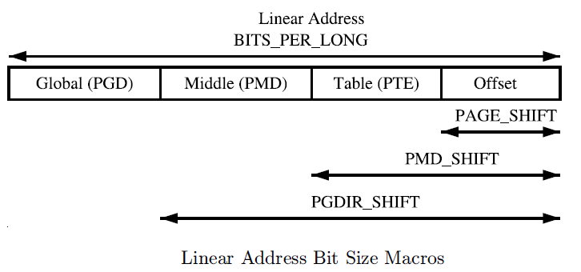
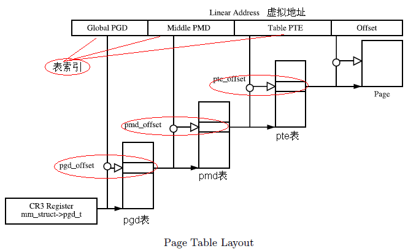

# mmu

   内存管理单元(Memory Management Unit)

Linux虚拟内存三级页表寻址，其中：

- [[PGD]]: page global directory
- PMD: page middle directory
- PTE: page table entry



虚拟地址利用3级页表访问物理内存：


[[TLB]]

## 逻辑地址、虚拟地址、线性地址、物理地址

逻辑地址：可以理解为程序经过编译链接之后(当我们把程序编译链接出来，逻辑地址就确定了)，代码段被赋值的地址，（可以使用objdump -d  elffile）查看代码段地址；

线性地址：elf文件被加载到内存中后的地址，也就是分段单元为程序分配的线性地址，也是cpu(取指令)，寄存器，所使用的地址，线性地址 == 虚拟地址；

物理地址：memory的实际地址，处理器通过使用这个地址在总线上和memory通信，达到读写的目的；

逻辑地址 通过 *分段单元* 转为 线性地址 通过 *分页单元*  转为 物理地址

由于linux arm64架构下面是没有分段的(或者说所有的进程段寄存器都是相同的值），分段只有x86架构下才有，分段的作用是把逻辑地址转换为虚拟地址，其实质就是为每个进程(数据代码段)分配不同的线性地址空间，而分页是把同一线性地址空间映射到不同的物理空间，而由第一节可以知道，linux  arm64下所有的程序的线性(虚拟)地址空间都是相同的为2^39=512G(范围ffffff8000000000-ffffffffffffffff)；

 因此 linux arm64下:
逻辑地址 == 线性地址 == 虚拟地址。

## 页表转换寄存器描述符

```c
pgd_offset(mm,addr)          ---接受内存描述符mm，和一个虚拟地址作为参数，这个宏产生addr在页全局目录在相应表项中的线性地址
pgd_offset_k(addr)           ---用来产生内核页全局目录在相应表项中的线性地址
pgd_index(addr)              ---从addr中提取页全局目录表项的索引
 
pmd_index(addr)              ---从addr中提取页中间目录表项的索引
pmd_offset(pud,addr)         ---接受页上级目录指针，和虚拟地址作为参数，这个宏产生目录项addr在页中间目录项中的偏移地址
 
pte_index(addr)              ---从addr中提取页中间目录表项的索引
pge_offset_kernel(dir,addr)  ---线性地址addr在页中间目录dir中有一个对应项，该宏就产生这个对应项，即页表的线性地址
```


## 虚拟地址转物理地址


> https://blog.csdn.net/w346665682/article/details/127130095