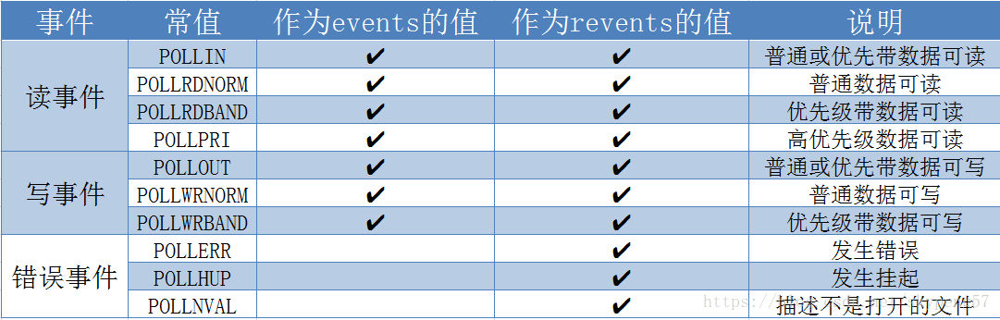

# poll

[来源](https://blog.csdn.net/skypeng57/article/details/82743681)

```shell
POLLIN         :    有数据可读。
POLLRDNORM     : 有普通数据可读。
POLLRDBAND     :  有优先数据可读。
POLLPRI        :     有紧迫数据可读。
POLLOUT        :    写数据不会导致阻塞。
POLLWRNORM     : 写普通数据不会导致阻塞。
POLLWRBAND     :  写优先数据不会导致阻塞。
POLLMSG SIGPOLL:   消息可用。
```

