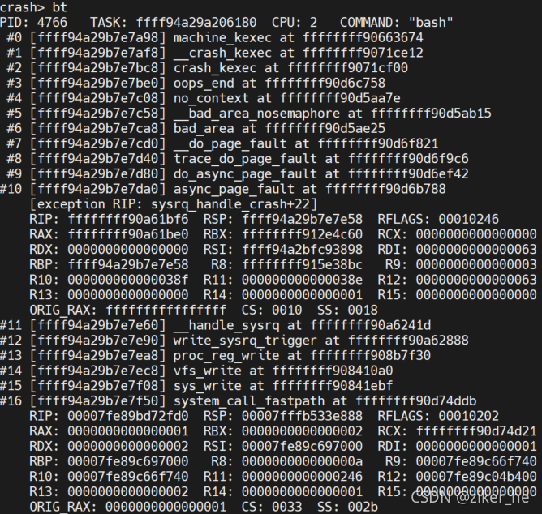

# bt


查看异常时的堆栈

-t: 显示符号信息
-f: 显示栈的所有数据
-l: 显示文件名和行号
pid: 可以显示指定pid进程的backtrace

- 例如


```shell
堆栈执行的函数顺序是由大到小，
大的是最开始执行的系统调用，
小的 #0 是切换到 crashkernel 的执行。
重点关注位置打印出很多寄存器的地址，
标准的信息是 exception RIP 表示出问题时候执行的指令。
我们可以找到 rip, dis -rl RIP(地址)  查看指令源码

crash> dis -rl ffffffff90a61bf6
/usr/src/debug/kernel-3.10.0-957.el7/linux-3.10.0-957.el7.x86_64/drivers/tty/sysrq.c: 134
0xffffffff90a61be0 <sysrq_handle_crash>:        nopl   0x0(%rax,%rax,1) [FTRACE NOP]
0xffffffff90a61be5 <sysrq_handle_crash+5>:      push   %rbp
0xffffffff90a61be6 <sysrq_handle_crash+6>:      mov    %rsp,%rbp
/usr/src/debug/kernel-3.10.0-957.el7/linux-3.10.0-957.el7.x86_64/drivers/tty/sysrq.c: 143
0xffffffff90a61be9 <sysrq_handle_crash+9>:      movl   $0x1,0x7e5721(%rip)        # 0xffffffff91247314
/usr/src/debug/kernel-3.10.0-957.el7/linux-3.10.0-957.el7.x86_64/drivers/tty/sysrq.c: 144
0xffffffff90a61bf3 <sysrq_handle_crash+19>:     sfence
/usr/src/debug/kernel-3.10.0-957.el7/linux-3.10.0-957.el7.x86_64/drivers/tty/sysrq.c: 145
0xffffffff90a61bf6 <sysrq_handle_crash+22>:     movb   $0x1,0x0

```

