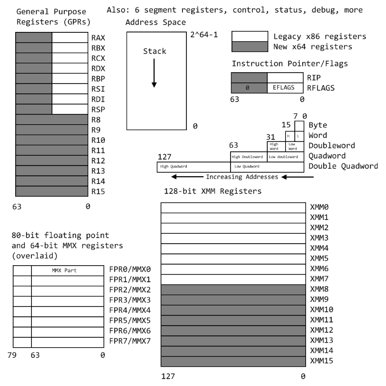

# x86_64

Documentation/arch/x86/x86_64/mm.rst: 内存分布

调用call指令之前，必须保证栈是16字节对齐的。

一个函数在调用时，如果参数个数小于等于6个时，
前6个参数是从左至右依次存放于RDS、RSI、RDX、RCX、R8、R9寄存器中，

第一个参数：RDI
第二个参数：RSI
第三个参数：RDX
第四个参数：RCX
第五个参数：R8
第六个参数：R9

如果参数大于6个，剩余的参数通过栈传递，从右至左顺序入栈。

XMM0 ~ XMM7 用于传递浮点参数，前8个参数从左至右依次存放在XMM0~XMM7中，剩余的参数通过栈传递，从右至左顺序入栈。

被调用函数的返回值64位以内（包括64位）的整形或指针时，则返回值存放在RAX，如果返回值128位的，则高64位放入RDX。
如果返回值是浮点值，则返回值存放在XMM0。
可选地，被调函数推入 RBP，以使 caller-return-rip 在其上方8个字节，并将 RBP 设置为已保存的 RBP 的地址。这允许遍历现有堆栈帧，通过指定GCC的 -fomit-frame-pointer 选项可以消除此问题。
对于 R8～R15 寄存器，我们可以使用 r8, r8d, r8w, r8b 分别代表 r8 寄存器的64位、低32位、低16位和低8位。
