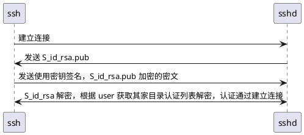

```
#0  user_key_allowed2 (pw=0x5555557098f0, key=0x5555556f2c10, file=0x5555557098a0 "/home/black/.ssh/authorized_keys", remote_ip=0x5555557099d0 "127.0.0.1",
    remote_host=0x5555557099d0 "127.0.0.1", authoptsp=0x7fffffffdd58) at auth2-pubkey.c:589
#1  0x0000555555598a17 in user_key_allowed (ssh=0x55555570e4c0, pw=0x5555557098f0, key=0x5555556f2c10, auth_attempt=1, authoptsp=0x7fffffffdde0)
    at auth2-pubkey.c:772
#2  0x000055555559f9a6 in mm_answer_keyallowed (ssh=0x55555570e4c0, sock=5, m=0x5555557105d0) at monitor.c:1175
#3  0x000055555559bbae in monitor_read (ssh=0x55555570e4c0, pmonitor=0x5555556f6ae0, ent=0x5555556a9a60 <mon_dispatch_proto20+192>, pent=0x7fffffffde98)
    at monitor.c:513
#4  0x000055555559ac27 in monitor_child_preauth (ssh=0x55555570e4c0, pmonitor=0x5555556f6ae0) at monitor.c:298
#5  0x000055555556317e in privsep_preauth (ssh=0x55555570e4c0) at sshd.c:497
#6  0x000055555556a2d5 in main (ac=8, av=0x5555556af2c0) at sshd.c:2255
```

---
- 初版

