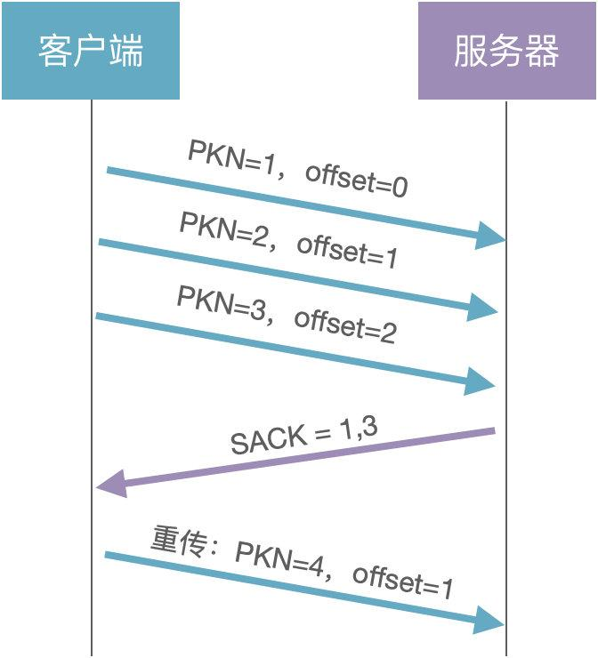

# QUIC

## 实现
```shell
git@github.com:h2o/quicly.git
```

## **1、QUIC 简介**

QUIC 全称：Quick UDP Internet Connections，是一种基于 UDP 的传输层协议。由 Google 自研，2012 年部署上线，2013 年提交 IETF，2021 年 5 月，IETF 推出标准版 RFC9000。


从协议栈可以看出：QUIC = HTTP/2 + TLS + UDP

## **2、QUIC 实现原理**

## **2.1、数据格式**

一个 QUIC 数据包的格式如下：


由 header 和 data 两部分组成。

header 是明文的，包含 4 个字段：Flags、Connection ID、QUIC Version、Packet Number；

data 是加密的，可以包含 1 个或多个 frame，每个 frame 又分为 type 和 payload，其中 payload 就是应用数据；

数据帧有很多类型：Stream、ACK、Padding、Window\_Update、Blocked 等，这里重点介绍下用于传输应用数据的 Stream 帧。


**Frame Type：** 帧类型，占用 1 个字节


（1）Bit7：必须设置为 1，表示 Stream 帧

（2）Bit6：如果设置为 1，表示发送端在这个 stream 上已经结束发送数据，流将处于半关闭状态

（3）Bit5：如果设置为 1，表示 Stream 头中包含 Data length 字段

（4）Bit432：表示 offset 的长度。000 表示 0 字节，001 表示 2 字节，010 表示 3 字节，以此类推

（5）Bit10：表示 Stream ID 的长度。00 表示 1 字节，01 表示 2 字节，10 表示 3 字节，11 表示 4 字节

**Stream ID：** 流 ID，用于标识数据包所属的流。后面的流量控制和多路复用会涉及到

\*\*Offset：\*\*偏移量，表示该数据包在整个数据中的偏移量，用于数据排序。

**Data Length：** 数据长度，占用 2 个字节，表示实际应用数据的长度

**Data：** 实际的应用数据

## **2.2、建立连接**

先分析下 HTTPS 的握手过程，包含 TCP 握手和 TLS 握手，TCP 握手：


从图中可以看出，TCP 握手需要 2 个 RTT。

TLS 握手：密钥协商（1.3 版本）


从图中可以看出，TLS 握手需要 1 个 RTT，也就是 1 次 RTT 就把通信密钥协商好了，这是怎么做到的？

（1）客户端：生成随机数 a，选择公开的大数 G 和 P，计算 A=a\*G%P，将 A 和 G 发送给服务器，也就是 Client Hello 消息

（2）服务器：生成随机数 b，计算 B=b\*G%P，将 B 发送给客户端，也就是 Server Hello 消息

（3）客户端：使用 ECDH 算法生成通信密钥 KEY = a*B = a*b\*G%P

（4）服务器：使用 ECDH 算法生成通信密钥 KEY = b*A = b*a\*G%P

所以，这里的关键就是 ECDH 算法，a 和 b 是客户端和服务器的私钥，是不公开的，而其他参数是公开的。ECDH 算法有个非常重要的特征：即使知道 A、G、P，通过 A = a\*G%P 公式也是无法推到出 a 的，保证了私钥的安全性。

综上所述，HTTPS 建立连接需要 3 个 RTT，由于 QUIC 的握手是基于 TLS1.3 实现的，所以首次建立连接时也是需要 1 次 RTT，那 QUIC 是如何做到 0-RTT 握手的呢？

## **2.2.1、0-RTT 握手**

其实原理很简单：客户端缓存了 ServerConfig（B=b\*G%P），下次建连直接使用缓存数据计算通信密钥：


（1）客户端：生成随机数 c，选择公开的大数 G 和 P，计算 A=c\*G%P，将 A 和 G 发送给服务器，也就是 Client Hello 消息

（2）客户端：客户端直接使用缓存的 ServerConfig 计算通信密钥 KEY = c*B = c*b\*G%P，加密发送应用数据

（3）服务器：根据 Client Hello 消息计算通信密钥 KEY = b*A = b*c\*G%P

也就是说，客户端不需要经过握手就可以发送应用数据，这就是 0-RTT 握手。再来思考一个问题：假设攻击者记录下所有的通信数据和公开参数（A1=a*G%P，A2=c*G%P，......），一旦服务器的随机数 b（私钥）泄漏了，那之前通信的所有数据就都可以破解了。

为了解决这个问题，需要为每次会话都创建一个新的通信密钥，来保证前向安全性

## **2.2.2、前向安全**

前向安全：是指用来产生会话密钥的长期密钥泄露出去，不会泄漏以前的通讯内容。


（1）客户端：生成随机数 a，选择公开的大数 G 和 P，计算 A=a\*G%P，将 A 和 G 发送给服务器，也就是 Client Hello 消息

（2）客户端：客户端直接使用缓存的 ServerConfig 计算初始密钥 initKey = a*B = a*b\*G%P，加密发送应用数据 1

（3）服务器：根据 Client Hello 消息计算初始密钥 initKey = b*A = b*a\*G%P

（4）服务器：生成随机数 c，计算 C=c\*G%P，使用 initKey 加密 C，发送给客户端，也就是 Server Hello 消息

（5）客户端：使用 initKey 解码获取 C，计算会话密钥 sessionKey = a*C = a*c\*G%P，加密发送应用数据 2

（6）服务器：计算会话密钥 sessionKey = c*A = c*a\*G%P，解密获取应用数据 2

客户端缓存的 ServerConfig 是服务器静态配置的，是可以长期使用的。客户端通过 ServerConfig 实现 0-RTT 握手，使用会话密钥 sessionKey 保证通信数据的前向安全。

## **2.3、可靠传输**

QUIC 是基于 UDP 协议的，而 UDP 是不可靠传输协议，那 QUIC 是如何实现可靠传输的呢？

可靠传输有 2 个重要特点：

（1）完整性：发送端发出的数据包，接收端都能收到

（2）有序性：接收端能按序组装数据包，解码得到有效的数据

问题 1：发送端怎么知道发出的包是否被接收端收到了？

解决方案：通过包号（PKN）和确认应答（SACK）


（1）客户端：发送 3 个数据包给服务器（PKN = 1，2，3）

（2）服务器：通过 SACK 告知客户端已经收到了 1 和 3，没有收到 2

（3）客户端：重传第 2 个数据包（PKN=4）

由此可以看出，QUIC 的数据包号是单调递增的。也就是说，之前发送的数据包（PKN=2）和重传的数据包（PKN=4），虽然数据一样，但包号不同。

问题 2：既然包号是单调递增的，那接收端怎么保证数据的有序性呢？

解决方案：通过数据偏移量 offset

每个数据包都有一个 offset 字段，表示在整个数据中的偏移量。



接收端根据 offset 字段就可以对异步到达的数据包进行排序了。为什么 QUIC 要将 PKN 设计为单调递增？解决 TCP 的重传歧义问题：

由于原始包和重传包的序列号是一样的，客户端不知道服务器返回的 ACK 包到底是原始包的，还是重传包的。但 QUIC 的原始包和重传包的序列号是不同的，也就可以判断 ACK 包的归属。

## **2.4、流量控制**

和 TCP 一样，QUIC 也是利用滑动窗口机制实现流量控制：


发送端的窗口大小由接收端告知，包括发送窗口和可用窗口，如果发送端收到了接收端的 ACK 确认应答（比如 ACK 36），那整个窗口就会向右滑动，发送新的数据包。


和 TCP 不同的是，QUIC 的滑动窗口分为 Connection 和 Stream 两种级别。Connection 流量控制：规定了所有数据流的总窗口大小；Stream 流量控制：规定了每个流的窗口大小。

假设现在有 3 个 Stream，滑动窗口分别如下：


则整个 Connection 的可用窗口大小为：20+30+10 = 60

## **2.5、拥塞控制**

拥塞控制是通过拥塞窗口限制发送方的数据量，避免整个网络发生拥塞。那拥塞窗口（cwnd）和滑动窗口（发送窗口：swnd，接收窗口：rwnd）有什么关系呢？

swnd = min（cwnd，rwnd）

也就是说，发送窗口的大小是由接收窗口和拥塞窗口共同决定的。那拥塞窗口的大小是如何计算的？通过 4 个拥塞控制算法：慢启动、拥塞避免、拥塞发生、快速恢复

## **2.5.1、慢启动**

初始拥塞窗口大小 cwnd=1，也就是可以传输 1 个 MDS（Max Datagram Size）大小的数据包，一般网卡允许传输的最大数据单元 MTU 的大小是 1500 字节。对于 UDP 数据报而言：MDS = 1500（MTU）- 20（IP 首部）- 8（UDP 首部） = 1472 字节

**慢启动算法**： 当发送方每收到一个 ACK，拥塞窗口就加 1（cwnd++）


由此可以看出，慢启动阶段，拥塞窗口呈指数增长，那增长到多少是个头？

有一个上限值：ssthresh（slow start threshold），从源码看，这个值是 2000 \* MDS

`const QuicPacketCount kDefaultMaxCongestionWindowPackets = 2000;`

+   当 **cwnd < ssthresh** 时，使用慢启动算法  
    
+   当 **cwnd >= ssthresh** 时，使用拥塞避免算法  
    

## **2.5.2、拥塞避免**

当拥塞窗口大小超过慢启动上限后，就会进入拥塞避免阶段。

**拥塞避免算法：** 当发送方每收到一个 ACK，拥塞窗口就加 1/cwnd


假设现在的 cwnd=8，可以发送 8 个数据包，当收到这 8 个包的 ACK 时，拥塞窗口才会加 1，由此可知，在拥塞避免阶段，拥塞窗口是线性增长的。

那啥时候是个头呢？不管，让它继续增长，直到网络发生拥塞，出现丢包，这时就会触发重传机制，进入拥塞发生阶段

## **2.5.3、拥塞发生**

重传有 2 种：超时重传和快速重传

如果发生超时重传，使用的拥塞发生算法为：

+   ssthresh = cwnd / 2  
    
+   cwnd = 1  
    


重新使用慢启动和拥塞避免算法增加拥塞窗口的大小。

如果发生快速重传（发送方收到 3 个相同的 ACK），使用的拥塞发生算法为：

+   cwnd = cwnd / 2  
    
+   ssthresh = cwnd  
    

接下来就会进入快速恢复阶段。

## **2.5.4、快速恢复**

快速恢复算法：cwnd = ssthresh + 3（因为收到 3 个 ACK），然后进入拥塞避免阶段。


## **2.5.5、常见算法**

+   New Reno：基于丢包检测  
    
+   CUBIC：基于丢包检测  
    
+   BBR：基于网络带宽  
    

和 TCP 不同的是，QUIC 是在用户空间实现的拥塞控制，可以非常灵活的设置，甚至可以为每一个请求都设置一种拥塞控制算法。

## **2.6、多路复用**

多路复用是 HTTP/2 的主要特性之一。

概念：单条 TCP 连接上可以同时发送多个 HTTP 请求，解决了 HTTP1.1 中单个连接 1 次只能发送 1 个请求的性能瓶颈。HTTP/2 能实现多路复用的根本原因是采用了二进制帧格式的数据结构。


+   Length：表示 Payload 的长度  
    
+   Type：表示帧类型  
    
+   Flags：帧标识  
    
+   Stream ID：数据帧所属的流  
    
+   Payload：应用数据，长度由 Length 字段指定  
    

一个请求就对应一条流，通过 Stream ID 就可以判断该数据帧属于哪个请求，假设有 A 和 B 两个请求，对应的 Stream ID 分别为 1 和 2，那这个 TCP 连接上传输的数据大概如下：


虽然在 HTTP 应用层，可以同时发送多个请求，但是在 TCP 传输层，仍然只有 1 个滑动窗口来发送这些数据包，考虑下面的情形：


客户端发送的 5 个数据包（56789）服务器都收到了，并且回应了 5 个 ACK，但是第 5 个数据包的 ACK 丢失了，导致客户端的发送窗口无法向前移动，也就无法发送新的数据，这就是 TCP 层的队头阻塞问题。

HTTP/2 虽然通过多路复用解决了 HTTP 层的队头阻塞，但仍然存在 TCP 层的队头阻塞。那 QUIC 是如何解决 TCP 层的队头阻塞问题的呢？其实很简单，HTTP/2 之所以存在 TCP 层的队头阻塞，是因为所有请求流都共享一个滑动窗口，那如果给每个请求流都分配一个独立的滑动窗口，是不是就可以解决这个问题了？

QUIC 就是这么做的：


A 请求流上的丢包不会影响 B 请求流上的数据发送。但是，对于每个请求流而言，也是存在队头阻塞问题的，也就是说，虽然 QUIC 解决了 TCP 层的队头阻塞，但仍然存在单条流上的队头阻塞。这就是 QUIC 声明的无队头阻塞的多路复用。

## **2.7、连接迁移**

连接迁移：当客户端切换网络时，和服务器的连接并不会断开，仍然可以正常通信，对于 TCP 协议而言，这是不可能做到的。因为 TCP 的连接基于 4 元组：源 IP、源端口、目的 IP、目的端口，只要其中 1 个发生变化，就需要重新建立连接。但 QUIC 的连接是基于 64 位的 Connection ID，网络切换并不会影响 Connection ID 的变化，连接在逻辑上仍然是通的。


假设客户端先使用 IP1 发送了 1 和 2 数据包，之后切换网络，IP 变更为 IP2，发送了 3 和 4 数据包，服务器根据数据包头部的 Connection ID 字段可以判断这 4 个包是来自于同一个客户端。QUIC 能实现连接迁移的根本原因是底层使用 UDP 协议就是面向无连接的。

## **参考文档**

【1】**[QUIC 标准文档](https://datatracker.ietf.org/doc/html/rfc9000)**

【2】**[30 张图解： TCP 重传、滑动窗口、流量控制、拥塞控制发愁](https://zhuanlan.zhihu.com/p/133307545)**

【3】**[天下武功，唯'QUICK'不破，探究 QUIC 的五大特性及外网表现](https://mp.weixin.qq.com/s/DHvvp6EUR5tDffJqzVir0A)**

【4】**[关于队头阻塞（Head-of-Line blocking），看这一篇就足够了](https://zhuanlan.zhihu.com/p/330300133)**
