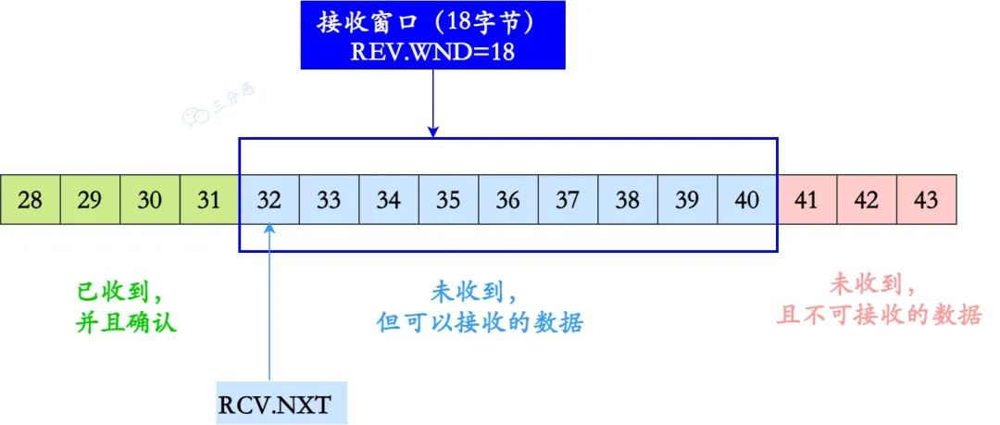
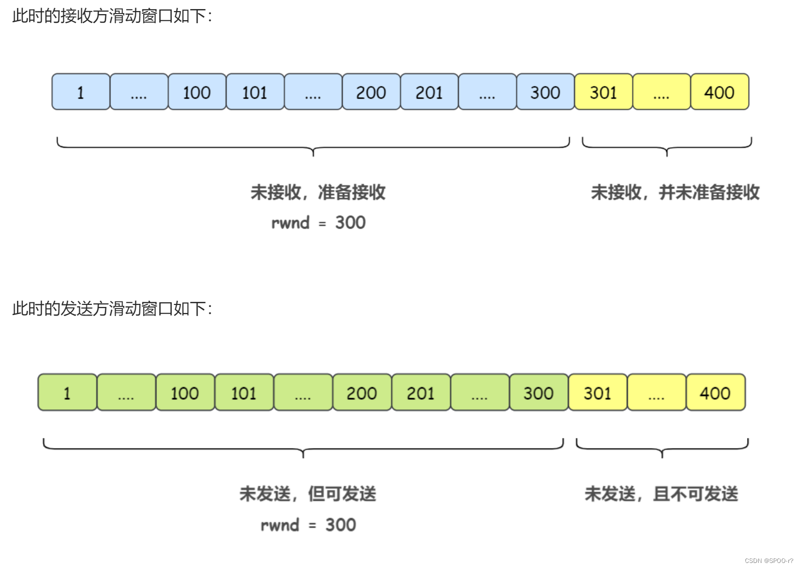
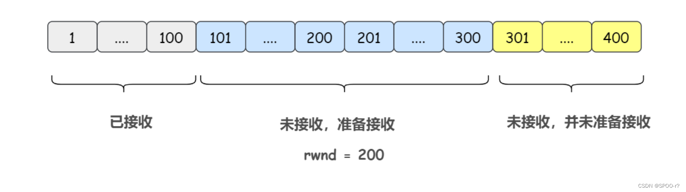
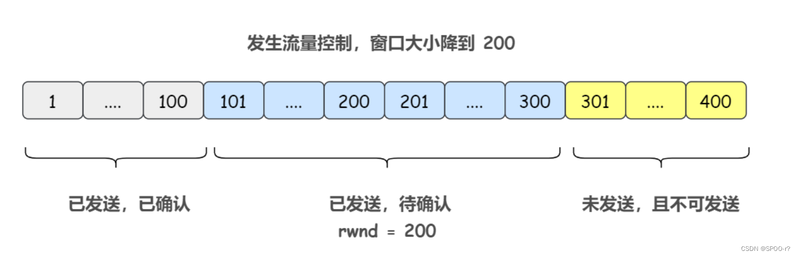
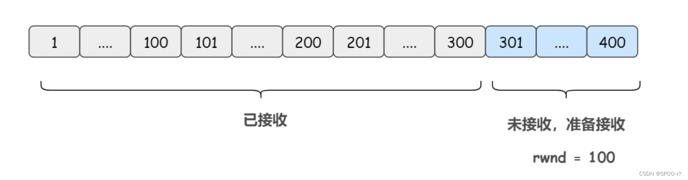
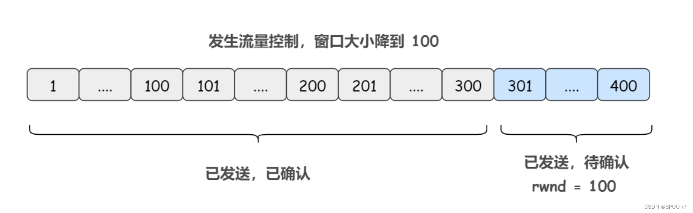

# TCP

## 滑动窗口协议
滑动窗口（Sliding Window）是一种用于实现流量控制和可靠数据传输的机制，在网络通信中被广泛使用，尤其是在传输控制协议（TCP）中。

滑动窗口是发送方和接收方之间的一种协议约定，用于控制发送方发送数据的速率和接收方接收数据的能力。接收方按照自己接收缓冲区大小和处理能力决定接收窗口大小，用接收窗口大小控制发送窗口大小，再由发送窗口大小控制发送速率。

- 发送窗口滑动:
    发送方发送一个数据段并收到ACK确认应答后，将发送窗口向前滑动，使其离开已确认的数据。这样，发送方可以继续发送新的数据，只要它在滑动窗口范围内。
- 接收方更新确认号:
    接收方根据接收到的报文段的序列号确定已成功接收的数据字节范围，并将确认号设置为下一个期望接收的字节的序列号（通常为接受到的报文段下一位）。
- 接收方更新、通告接收窗口大小:
    接收方根据已成功接收的数据字节数和初始窗口大小计算可用的接收窗口大小。并接收方将新的接收窗口大小通过 TCP 报文段中的窗口大小字段通告给发送方。这个值告诉发送方接收方的当前可用缓冲区空间。
- 动态调整窗口大小:
    接收方通过ACK确认号通知发送方已成功接收的数据。发送方可以根据接收方通告的窗口大小进行数据发送控制——如果接收方的窗口变大，发送方可以发送更多的数据；如果接收方的窗口变小，发送方需要适应减少的窗口大小。
- 流量控制:
    通过滑动窗口机制，接收方可以动态调整窗口大小以限制发送方的数据发送速率。接收方通过通告窗口大小，告知发送方自己的可用缓冲区空间。发送方根据接收方的窗口大小调整发送速率，确保不会超出接收方的处理能力。

## 发送窗口和接受窗口

TCP 滑动窗口分为两种: 发送窗口和接收窗口。

发送端的滑动窗口包含四大部分，如下：
-  已发送且已收到 ACK 确认
- 已发送但未收到 ACK 确认
- 未发送但可以发送
- 未发送也不可以发送

发送端滑动窗口

深蓝色框里就是发送窗口。
- SND.WND: 表示发送窗口的大小, 上图虚线框的格子数是 10 个，即发送窗口大小是 10。
- SND.NXT：下一个发送的位置，它指向未发送但可以发送的第一个字节的序列号。
- SND.UNA: 一个绝对指针，它指向的是已发送但未确认的第一个字节的序列号。

**接收方的滑动窗口**包含三大部分，如下：
- 已成功接收并确认
- 未收到数据但可以接收
- 未收到数据并不可以接收的数据

接收方滑动窗口
- 蓝色框内，就是接收窗口。
- REV.WND: 表示接收窗口的大小, 上图虚线框的格子就是 9 个。
- REV.NXT: 下一个接收的位置，它指向未收到但可以接收的第一个字节的序列号。

## 滑动窗口示例

综上，举个发生流量控制和超时重传的滑动窗口例子，假设发送方需要发送的数据总长度为 400 字节，分成 4 个报文段，每个报文段长度是 100 字节: 1

1. TCP三次握手连接建立时，接收方告诉发送方：我的接收窗口rwnd大小是 300 字节。
2. 发送方发送第一个报文段(序号 1 - 100)，还能再发送 200 个字节。
3. 发送方发送第二个报文段(序号 101 - 200)，还能再发送 100 个字节。
4. 发送方发送第三个报文段(序号 201 - 300)，还能再发送 0 个字节 此时，发送方的窗口中存了三个待收到ACK的报文段了。
5. 接收方接收到了第一个报文段： ack = 101, rwnd = 200，第三个报文段：ack = 101, rwnd = 200，中间第二个报文段丢失。
    (同时假设这里发生流量控制，把窗口大小降到了 200。原本rwnd=300-100+100，rwnd收到一个报文段-100，处理一个报文段+100，随后流量控制窗接收方缓冲区还剩200)。
6. 发送方收到第一个包和第三个包的确认，并从窗口中删除第一个包段。但swnd的左端滑动到101的时候，还未收到第二个包的确认，无法继续滑动，然后等待收到该报文。
    其中，每次swnd窗口都会根据ack报文进行调整、滑动(接收窗口rwnd大小变为200, 那发送方swnd也得变小)。此时的发送方滑动窗口swnd如下：
7. 发送端没有收到第二个报文段的确认回复，等待超时后重新发送第二个报文段（序号 101 - 200），并且启动TCP拥塞控制（但在这里被省略了，只专注于窗口滑动）。
8. 接收端成功接收到第二个包段(之前收到了第一、三个报文段)，并返回一个报文段 ack = 301, rwnd = 100 给发送端(假设这里发生了流量控制，接收方将窗口大小减少到100)。
9. 发送方窗口收到之前所有ACK，发送窗口根据最后那个ACK报文ack=301，rwnd=100进行调整，使得swnd=100，swnd左端向右滑动到ACK期待下一个位置301。
10. 发送方发送第四个报文段 (序号 301 - 400)。

## 参考

- [TCP滑动窗口协议](https://blog.csdn.net/qq_46631497/article/details/137253124)
