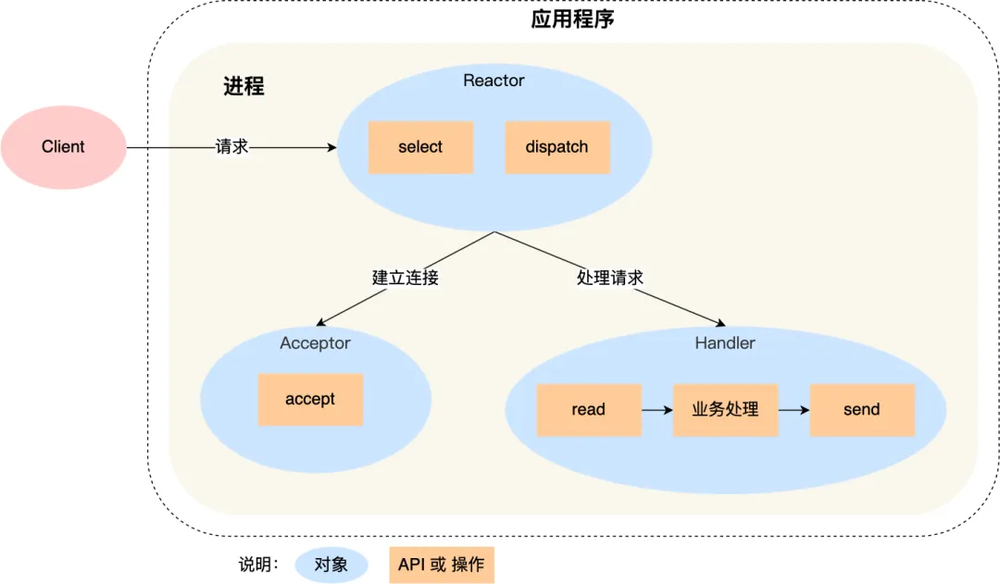
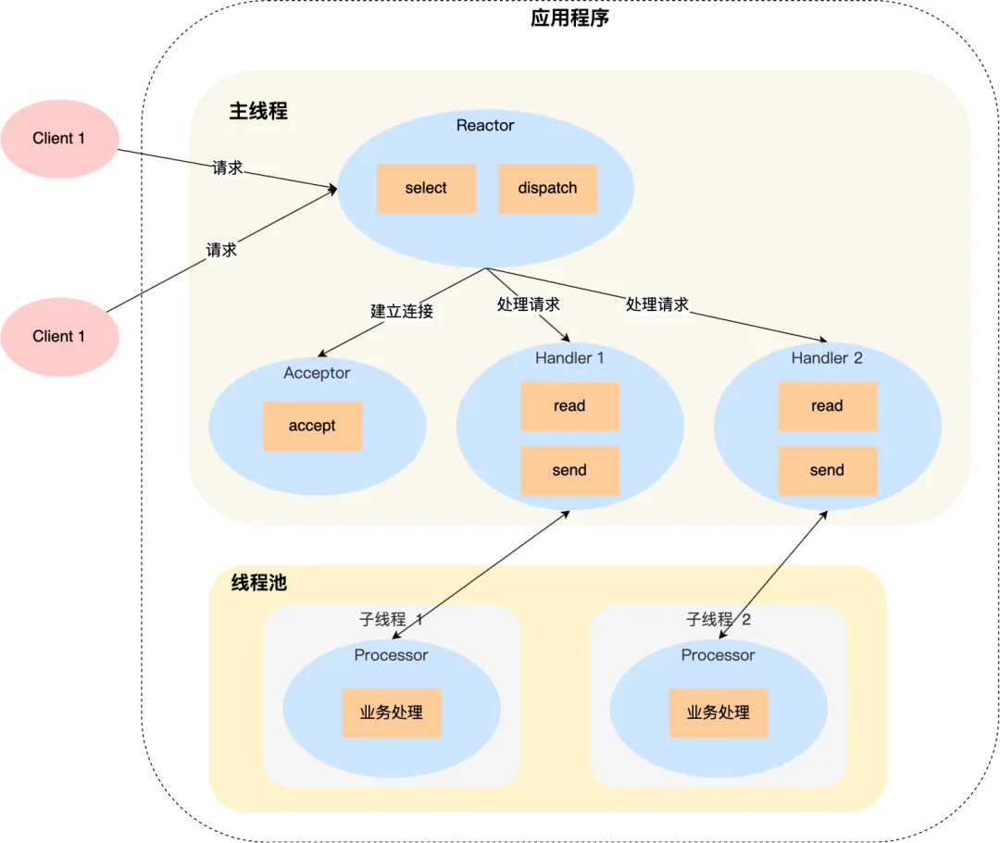
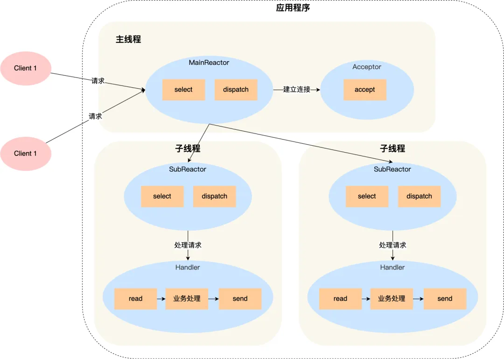
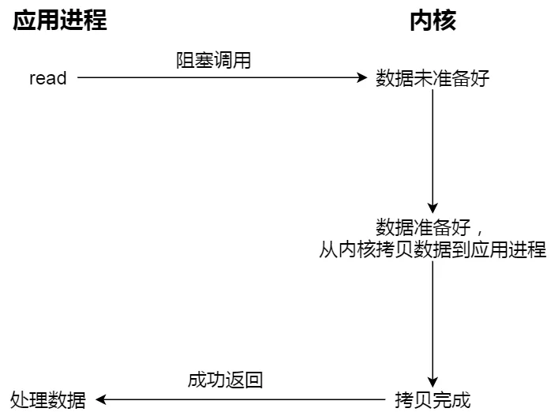
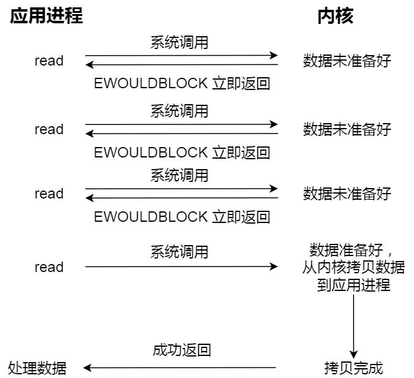
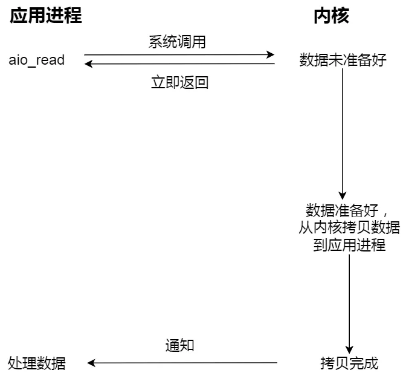
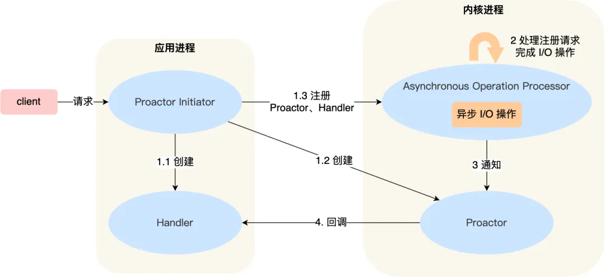

# 网络模型

Reactor 可以理解为「来了事件操作系统通知应用进程，让应用进程来处理」，
而 Proactor 可以理解为「来了事件操作系统来处理，处理完再通知应用进程」。

Reactor 模式是基于「待完成」的 I/O 事件，
而 Proactor 模式则是基于「已完成」的 I/O 事件。

Reactor 是非阻塞同步网络模式，感知的是就绪可读写事件。在每次感知到有事件发生（比如可读就绪事件）后，就需要应用进程主动调用 read 方法来完成数据的读取，也就是要应用进程主动将 socket 接收缓存中的数据读到应用进程内存中，这个过程是同步的，读取完数据后应用进程才能处理数据。
Proactor 是异步网络模式， 感知的是已完成的读写事件。在发起异步读写请求时，需要传入数据缓冲区的地址（用来存放结果数据）等信息，这样系统内核才可以自动帮我们把数据的读写工作完成，这里的读写工作全程由操作系统来做，并不需要像 Reactor 那样还需要应用进程主动发起 read/write 来读写数据，操作系统完成读写工作后，就会通知应用进程直接处理数据。

## reactor 模型

### 单 reactor 单线程模型

### 单 reactor 多线程模型

### 多 reactor 多线程模型

## proactor 模型

> https://developer.aliyun.com/article/893894
